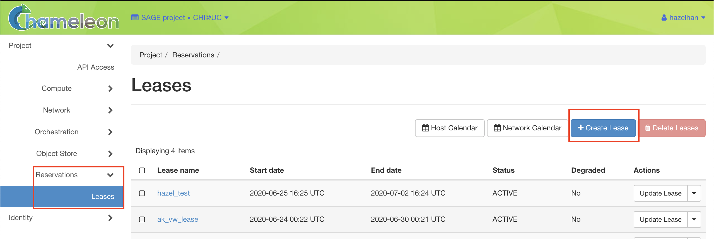

# How to use Chameleon

This step-by-step instruction will guide you on how to use Chameleon.<br/>
This document covers from creating Chameleon account to logging into Chameleon using Floating IP allocated to your instance.<br/>
It also includes a number of screenshots to help you get on Chameleon as easy and fast as possible.<br/>
For more detailed information, you can refer to https://chameleoncloud.readthedocs.io/. <br/>
If you would like to know how to use Chameleon with docker images, refer to https://github.com/sagecontinuum/chameleon-client/.

## Getting started

Go to [ChameleonHome](https://www.chameleoncloud.org/) and sign up. Then, ask PI to get you added on the proper project.<br/>
If you are added to the project, you will be able to access the Chameleon Dashboard. <br/>
Clicking <strong>CHI@UC</strong> or <strong>CHI@TACC</strong> will lead you to the Dashboard.

<br/>


<br/>
Go to the Dashboard and either Create a key pair or Import your SSH public key. <br/>
If you have already generated your own SSH key pair, your public key could be found in <code>~/.ssh/id_rsa.pub</code>. 

<br/><br/>


<br/>
This key pair will be used when you attempt to run your docker image on Chameleon directly by using CLI. <br/>
For more info on docker and Chameleon, please refer to https://github.com/sagecontinuum/chameleon-client/. <br/>
Otherwise, for native use of Chameleon, follow the instruction below.

## Create an instance

### 1. Reserve a Node <br/>
Go to the Dashboard again and click <strong>Lease</strong> under <strong>Reservation</strong> from the sidebar. <br/>
Click on <strong>Create Lease</strong> then the wizard will be loaded. <br/>

<br/>


<br/>
Name your lease and decide the lease length. Maximum lease length is 7 days. 

<br/><br/>


<br/>
Then find <strong>Resource Properties</strong> section and choose proper property for your use. <br/>
For AI/ML related uses, you might want to choose <strong>node_type = gpu_rtx_6000</strong>. <br/>
Lastly, indicate the number of Floating IP addresses needed for your use. 

<br/><br/>


### 2. Launch an Instance <br/>
Once your reservation gets ACTIVE, launch a bare-metal instance on the node you have reserved. <br/>
Click <strong>instances</strong> under <strong>Compute</strong> from the sidebar, and click <strong>Launch Instance</strong>, then the wizard will be loaded. 

<br/>


<br/>
Name your instance and associate it with your node (reservation). 

<br/><br/>


<br/>
Then click <strong>Source</strong> in sidebar and choose OS image. If you want an image with CUDA installed, search for it. <br/>
For AI/ML related uses, <code>CC-Ubuntu18.04-CUDA10</code> is highly recommended. 

<br/><br/>


<br/><br/>


<br/>
Then, click <strong>Flavor</strong> from the sidebar and check if it is correctly selected as <strong>baremetal</strong> flavor.

<br/><br/>


<br/>
Then, click <strong>Key Pair</strong> from the sidebar and either Create a Pair or Import a Pair. <br/>
In my case, I just allocated the key the I have registered previously. 

<br/><br/>


<br/>
If you have come so far, you now have basic configuration for your instance! <br/>
Press <strong>Lauch Instance</strong> button on the bottom. 

### 3. Associate Floating IP addresses <br/>
Now you will be able to see your instance created as below.
<br/><br/>


<br/>
Next step you have to take is associating <strong>Floating IP addresses</strong> with your instance.<br/>
Click <strong>Floating IPs</strong> under <strong>Network</strong> from the sidebar. Then you will see an IP address not associated with any other instances. <br/>
Click the <strong>Associate</strong> button to allocate that IP address to your instance.

<br/><br/>


<br/>
Then the wizard will be loaded. Select your instance port for <strong>Port to be associated</strong>.

<br/><br/>


<br/>
Now if you go back to <strong>instances</strong> under <strong>Compute</strong> again, you will see your instance created there with the Floating IP you have allocated. 

<br/>


## Accessing your instance <br/>
Once your instance has launched with an associated Floating IP address. <br/>
You can log in to your Chameleon instance via SSH using the <strong>cc user account and your floating IP address</strong>. <br/>
If your floating IP address was 192.5.87.31, you should use the command: ```ssh cc@192.5.87.31```. <br/>


