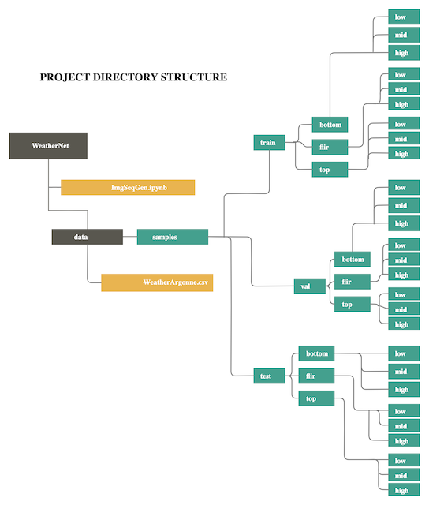

# Rick's Repo Home Page

## ImgSeqLoader
* This directory contains code for the data loader I made for my model that forecasts solar radiation amounts. This data loader feeds in three sets of time-sequenced images from three different cameras. The data loader navigates the folder structure (as shown below) and grabs the correct called images and deletes from memory the old images from memory.

                                                                                          
                                                                                         
In the repo, you will find an example .ipynb notebook showing how the data loader and how it fetches images. There are limited examples of how to build a data loader on the internet with multiple inputs and also for sequence-based images, so this may be a useful resource for constructing your own data loader for image sequences (video). 

 

## LSTM Solar Forecast
* For my experiment, one of the test consist of using a LSTM to forecast solar radiation. This is used as a baseline to compare the performance of WeatherNet.
Inside this directory, is an array of files however, for the finshed and documented experiment refer to the folder LSTM_Weather_Data_Experiment.

## ProjectUpdates
* This repo contains slides from my weekly update meetings.

## log
* Inside this directory, you will find my daily schedules, which document what I worked on each day during summer.

 

## DataPrep
* DataPrep is an assortment of python scripts used to build the dataset. This folder is not organized for recreating the dataset but merely was a dump for my work while making the dataset. THIS FOLDER'S CODE DOES NOT NEED TO BE READ IN ORDER TO UNDERSTAND THE PROJECT (save yourself the time).

