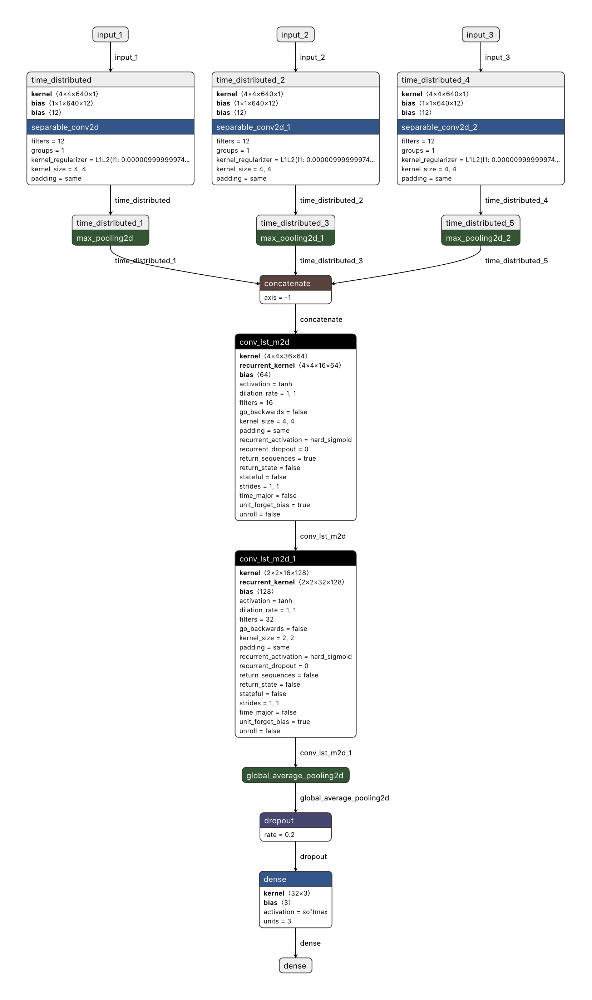
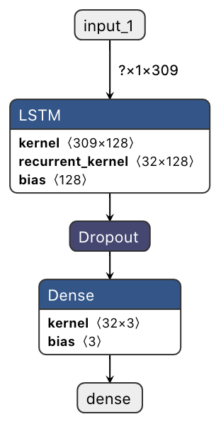

# Rick's Repo Home Page

## Notes:
* Scale seq generator images by /255 

 

## To do list :)
1.  [Done] Make update slides for ML Demo for Thursday (July 2, 2020).
2.  [Done] Update data split script for weather data work on 15min.
3.  [Done] Re-run lstm experiment using 15min data.
4.  [Done] Document new lstm experiment 
5.  [Done] Update paper
6.  [Done] Make image sequence .npy files for ConvLSTM
7.  [Done] Build new dataloader that takes images and weather data
8.  [ ] Build .py scripts to rebuild npy dataset on server
9.  [ ] Test ConvLSTM on sequences
10. [ ] Update github/paper 
11. [ ] Test ConvLSTM with weather data
12. [ ] Update github/paper

 

## WeatherNet_v2
* This is the main directory of the project! All of the codes needed to reconstruct the experiment can be found in here!

 

## ImgSeqLoader [ This goes to WeatherNet_v1 ]
* This directory contains code for the data loader I made for my model that forecasts solar radiation amounts. This data loader feeds in three sets of time-sequenced images from three different cameras. The data loader navigates the folder structure (as shown below) and grabs the correct called images and deletes from memory the old images from memory.

                                                                                          
                                                                                         
In the repo, you will find an example .ipynb notebook showing how the data loader and how it fetches images. There are limited examples of how to build a data loader on the internet with multiple inputs and also for sequence-based images, so this may be a useful resource for constructing your own data loader for image sequences (video). 

 

## WeatherNet_v1
* This directory contains code for the WeatherNetV1. WeatherNetV1 would not learn to be able to predict out of sample. The following reason are why I believe it did not work.
1. The model did not know the current value of solar energy.
2. The size of 6 images for a single sample was not ideal since again, each sample did not have a corresponding intial condition. 
3. My belief is that the model with be highly influenced by the brightness of the images and cloud coverage (which in hand will also affect brightness)

 

 

## LSTM Solar Forecast [This is the model from experiment two in the paper]
* For my experiment, one of the test consist of using a LSTM to forecast solar radiation. This is used as a baseline to compare the performance of WeatherNet.
Inside this directory, is an array of files however, for the finshed and documented experiment refer to the folder LSTM_Weather_Data_Experiment.

 

## ProjectUpdates
* This repo contains slides from my weekly update meetings.

## log
* Inside this directory, you will find my daily schedules, which document what I worked on each day during summer.

 

## DataPrep
* DataPrep is an assortment of python scripts used to build the dataset. This folder is not organized for recreating the dataset but merely was a dump for my work while making the dataset. THIS FOLDER'S CODE DOES NOT NEED TO BE READ IN ORDER TO UNDERSTAND THE PROJECT (save yourself the time).

