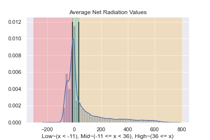
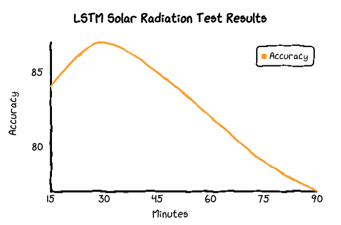

# WeatherNet V2

## 1. get_data_bash
Run this script to get data off of @bebop.lcrc.anl.gov. Two files are returned: flir and image. Create a new dir called lcrc_data and move both flir and image 
into lcrc_data.

 

## 2. Run parse_15_min_data.ipynb inside of weather_data_15min
The directory named weather_data_15min containts a folder called 15_min_data (this folder has the original weather data sampled at 15 minute intervals),
a script named parse_15_min_data.ipynb. Run the .ipynb file and a csv file named 15_min_weather_prep.csv is created and an image named Average_Net_Radition_Values_pic.jpg.
The file 15_min_weather_prep.csv will be used for the experiments. The image Average_Net_Values_pic.jpg shows the distribution of radiation values and the
three categories the values get put into.

    

 

## 3. Run prep_lcrc_data.py
This script will give create a new folder for the each type of image (flir, top, bottom) and move the respective files within. The files also get renamed
where the name is a timestamp. The script also removed images if the corresponding image from a particular time can't be found from all three cameras.
The new folders are stored in a new folder called data_clean.
 

## 4. Run tower data test within TowerDataTest 
Run Scale_Train_Test.ipynb to create two .csv files: train_weather.csv and test_weather.csv. Then run test_tower_data.ipynb to train and test model to foreacast 15 minute future solar values.

 

### Forecast solar radiation with LSTM using tower data results

|                              |           |        |          |         | 
|------------------------------|-----------|--------|----------|---------|
| 15 Minutes: Input length = 4 | Precision | Recall | F1-Score | Support |  
| Low                          | 0.90      | 0.83   | 0.86     | 249     |  
| Mid                          | 0.49      | 0.67   | 0.56     | 106     |  
| High                         | 0.95      | 0.90   | 0.92     | 391     |     
| Accuracy                     |           |        | 0.84     | 746     |  
|                              |           |        |          |         |   
|                              |           |        |          |         |    
|                              |           |        |          |         |     
| 30 Minutes: Input length = 4 | Precision | Recall | F1-Score | Support |     
| Low                          | 0.96      | 0.87   | 0.91     | 249     |     
| Mid                          | 0.54      | 0.88   | 0.67     | 106     |     
| High                         | 0.98      | 0.87   | 0.93     | 391     |     
| Accuracy                     |           |        | 0.87     | 746     |     
|                              |           |        |          |         |     
|                              |           |        |          |         |     
| 45 Minutes: Input length = 4 | Precision | Recall | F1-Score | Support |     
| Low                          | 0.94      | 0.85   | 0.89     | 249     |     
| Mid                          | 0.51      | 0.73   | 0.60     | 106     |     
| High                         | 0.94      | 0.89   | 0.91     | 391     |     
| Accuracy                     |           |        | 0.85     | 745     |     
|                              |           |        |          |         |     
|                              |           |        |          |         |     
|                              |           |        |          |         |     
| 60 Minutes: Input length = 4 | Precision | Recall | F1-Score | Support |    
| Low                          | 0.86      | 0.80   | 0.83     | 249     |     
| Mid                          | 0.46      | 0.59   | 0.52     | 106     |     
| High                         | 0.94      | 0.90   | 0.92     | 391     |     
| Accuracy                     |           |        | 0.82     | 746     |     
|                              |           |        |          |         |     
|                              |           |        |          |         |     
| 75 Minutes: Input length = 4 | Precision | Recall | F1-Score | Support |    
| Low                          | 0.83      | 0.74   | 0.78     | 249     |     
| Mid                          | 0.38      | 0.57   | 0.45     | 106     |     
| High                         | 0.94      | 0.88   | 0.91     | 391     |     
| Accuracy                     |           |        | 0.79     | 746     |     
|                              |           |        |          |         |     
| 90 Minutes: Input length = 4 | Precision | Recall | F1-Score | Support |     
| Low                          | 0.78      | 0.70   | 0.74     | 249     |     
| Mid                          | 0.35      | 0.52   | 0.42     | 106     |     
| High                         | 0.95      | 0.88   | 0.91     | 391     |     
| Accuracy                     |           |        | 0.77     | 746     |     

 

## 5. Create img seq .npy files by running make_npy_samples.ipynb
In make_npy_samples.ipynb, select the length of the images sequences. Like the LSTM experiment that used four samples to form an hour long sequence, four ordered photos were used to make a sample. The script creates a dir called npy_dataset and make three dirs inside called top, bottom, and flir. The program places the npy sequence samples in the respective folder based on what type on the type of image.

 

## 6. Create scaled input and label dataframes for npy dataset for 15, 30, 45, 60, 75, and 90 min weather data.
This script will scale the data based on training size (training data goes up to the date, 2020_05_24_04_30). This is done by running make_weather_data_npy.ipynb.

  

## 7. ImgSeqGen.ipynb
This notebook holds and demos the generator class that will be used my the model. It takes in data from a labels csv, a weather csv, and the three cameras and outputs shaped batches for the model.

 

## 7. Camera Data Test 
Run the WeatherNetV2_Model_Test.ipynb using the only the images, time, and previous period target values. The results of this experiment correspond to experiment two within the paper.

### Forecast solar radiation with ConvLSTM using images, time, and previous target values results

|                              |           |        |          |         | 
|------------------------------|-----------|--------|----------|---------|
| 15 Minutes: Input length = 4 | Precision | Recall | F1-Score | Support |  
| Low                          | 0.90      | 0.88   | 0.89     | 240     |  
| Mid                          | 0.78      | 0.79   | 0.78     | 165     |  
| High                         | 0.97      | 0.97   | 0.97     | 331     |     
| Accuracy                     |           |        | 0.90     | 736     |  
|                              |           |        |          |         |   
|                              |           |        |          |         |    
|                              |           |        |          |         |     
| 30 Minutes: Input length = 4 | Precision | Recall | F1-Score | Support |     
| Low                          | 0.82      | 0.87   | 0.84     | 209     |     
| Mid                          | 0.77      | 0.67   | 0.72     | 165     |     
| High                         | 0.95      | 0.98   | 0.96     | 266     |     
| Accuracy                     |           |        | 0.86     | 640     |   

|                              |           |        |          |         |     
|                              |           |        |          |         |     
| 45 Minutes: Input length = 4 | Precision | Recall | F1-Score | Support |     
| Low                          | 0.94      | 0.85   | 0.89     | 249     |     
| Mid                          | 0.51      | 0.73   | 0.60     | 106     |     
| High                         | 0.94      | 0.89   | 0.91     | 391     |     
| Accuracy                     |           |        | 0.85     | 745     |     
|                              |           |        |          |         |     
|                              |           |        |          |         |     
|                              |           |        |          |         |     
| 60 Minutes: Input length = 4 | Precision | Recall | F1-Score | Support |    
| Low                          | 0.86      | 0.80   | 0.83     | 249     |     
| Mid                          | 0.46      | 0.59   | 0.52     | 106     |     
| High                         | 0.94      | 0.90   | 0.92     | 391     |     
| Accuracy                     |           |        | 0.82     | 746     |     
|                              |           |        |          |         |     
|                              |           |        |          |         |     
| 75 Minutes: Input length = 4 | Precision | Recall | F1-Score | Support |    
| Low                          | 0.83      | 0.74   | 0.78     | 249     |     
| Mid                          | 0.38      | 0.57   | 0.45     | 106     |     
| High                         | 0.94      | 0.88   | 0.91     | 391     |     
| Accuracy                     |           |        | 0.79     | 746     |     
|                              |           |        |          |         |     
| 90 Minutes: Input length = 4 | Precision | Recall | F1-Score | Support |     
| Low                          | 0.78      | 0.70   | 0.74     | 249     |     
| Mid                          | 0.35      | 0.52   | 0.42     | 106     |     
| High                         | 0.95      | 0.88   | 0.91     | 391     |     
| Accuracy                     |           |        | 0.77     | 746     | 

