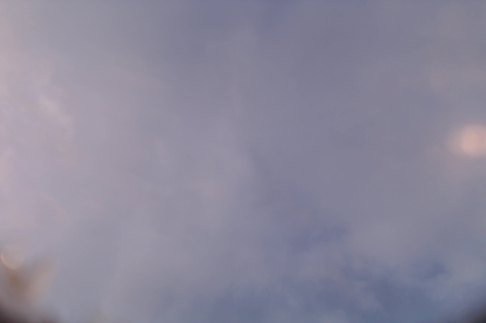
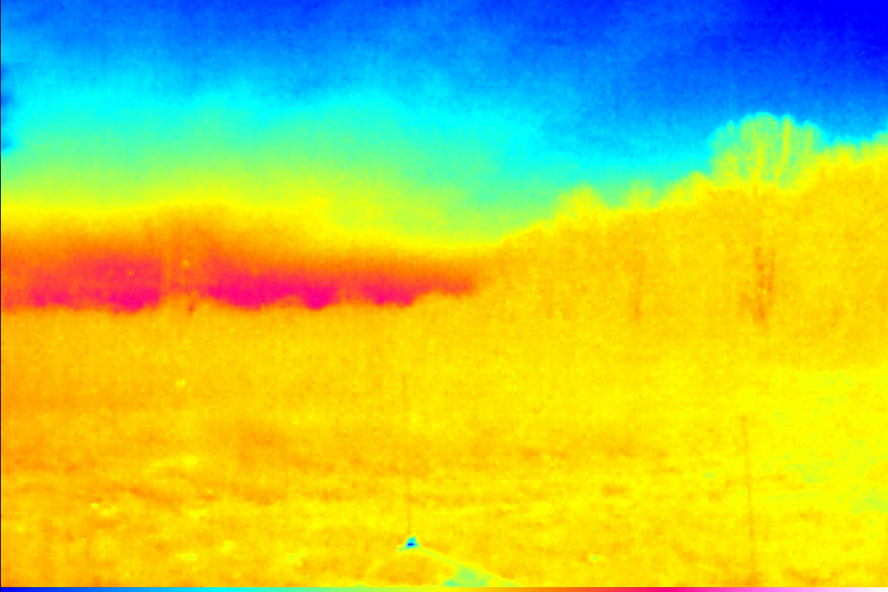
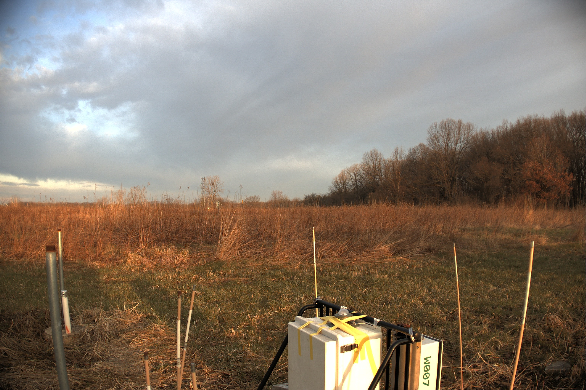
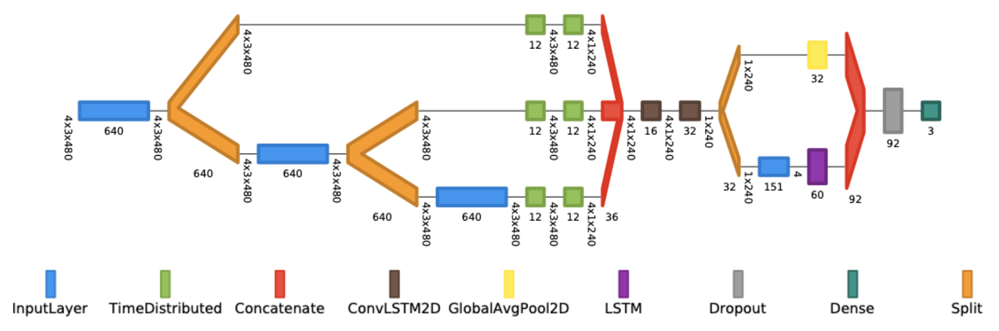

# Nowcasting over the Edge 
## by Rick Nueve

---

### What is Nowcasting?

Nowcasting is the task of weather forecasting within a horizon period of twenty-four hours.3 By
being able to accurately nowcast, abrupt weather changes can be announced earlier. This could allow
people to have the needed time to prepare for weather-related dangers such as hail, thunder, or tornados.

---

### Nowcasting and Deep Learning

Traditionally, nowcasting is performed by Numerical Weather Prediction (NWP) models that use radar data. However, 
recently, many scientists have developed ways to conduct nowcasting using Deep Learning and have achieved great success.
As of March 2020, Google Research released a paper documenting a Deep Learning model that performs nowcasting called MetNet.1
MetNet was able to outperform the High-Resolution Rapid Refresh (HRRR) system, the state of the art NWP method available from
NOAA (the National Oceanic and Atmospheric Administration) for precipitation forecasting within a 7-8 hour window. Both NWP models and 
Deep Learning nowcasting models use radar data as input. Radar data does provide powerful insight into macro
atmospheric activity. However, I hypothesize that adding data from ground-based sensors to nowcasting models could improve nowcasting
for precise locations. To be able to accurately nowcast for a precise location, it is reasonable to assume that information about the site is
needed- which is not provided through traditional radar data. 

To explore the plausibility of using ground-based sensor data to enhance the performance of a nowcasting model,
I sought out to develop a rudimentary experiment that would provide insight into my hypothesis. I desired to construct a Deep Learning model that only used ground-based sensor data to perform nowcasting. The reasoning was that if I was able to perform nowcasting using only ground-based sensor data (which is unique from radar data), then it would be plausible that combining ground-based sensor data with radar data could create a more powerful model. Vice-versa, if a Deep Learning model that only used ground-based sensor data could not perform nowcasting to any degree, it would be unlogical to assume that combining ground-based sensor data and radar data would improve a model's ability to nowcast- thus voiding the plausibility of my hypothesis. 

---

### Data Managment with SAGE

For my experiment, I employed SAGE, a Cyber infrastructure for AI at the Edge. SAGE allowed me to access a weather tower and a node with a ground-based camera system, located on the Argonne National Laboritory campus, with ease to harvest data. The weathe tower collected the following metadata: wind speed, wind direction, precipition, heat flux, irrradiation, net radation, vapor preasure, and dew point temperature. The camera system consitted of three cameras: a sky facing RGB camera, a horizon-facing RGB camera, and an infrared (FLIR) camera. Through the weather sensors and the cameras (ground-based senors), I was able to collect a dataset for my desired experiment. 

#### Sample Images from Camera System 
Sky facing                 |  FLIR                     | Horizon facing
:-------------------------:|:-------------------------:|:-------------------------:
  |  | 

Upon collecting the data, I restructured the data into fifteen-minute samples. Then the data was separated into four-element tuples consisting of data samples from an hour at 00, 15, 30, and 45 minutes. For my experiment, I decided to nowcast net radiation. Net radiation is the difference between incoming solar radiation absorbed by the Earth's surface and the radiation reflected back into space.2 Thus, my model's input data was four samples from the previous hour consisting of images from each camera and weather sensor data, while my model's prediction value was a future period's net radiation amount. 

---

### WeatherNet

With the data consisting of images from the camera and tabular data from the weather sensors in the form of a time-series, the Deep Learning model used was a Convolutional LSTM variant, named WeatherNet. Convolutional LSTM's allow as input images in the form of time series and can learn the temporal relationships between the images. This allowed WeatherNet to learn changes in the weather over time.4 By further modifying the traditional Convolutional LSTM, WeatherNet was also able to take as input, not just images, but also the tabular weather sensor data. WeatherNet was then trained to nowcast net radiation for 15, 30, 60, 75, and 90 minute horizon periods. 

#### Diagram of WeatherNet
 

### Results

---

### Conclusion

---

### About the Author

---

## Refrence
[1] Casper Kaae Sønderby et al.MetNet: A Neural Weather  Model  for  Precipitation  Forecasting.2020. arXiv:2003.12140 [cs.LG].  
[2] StoryMapJournal.URL:https://www.arcgis.com/apps/MapJournal/index.html?appid=93ed895dfa3343eb9b821a2933decdd8.  
[3] Yong  Wang  et  al.Guidelines  for  Nowcasting Techniques. Nov. 2017.ISBN: 978-92-63-11198-2  
[4] Xingjian  Shi  et  al.Convolutional  LSTM  Net-work:  A  Machine  Learning  Approach  for  
    Pre-cipitation   Nowcasting.   2015.   arXiv:1506 .04214 [cs.CV].  

