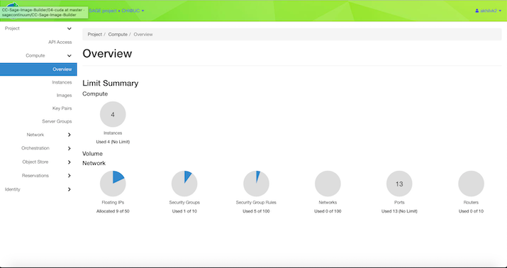

# The Integration of Chameleon and Sage
Hello! My name is Akhil Kodumuri, and I am currently a sophomore pursuing a Computer Engineering degree at the University of Illinois at Urbana-Champaign. My work with Sage this Summer consisted mostly with integrating Sage AI at the edge cyberinfrastructure with the Chameleon platform.

### Setting The Stage
The goal of the Sage project is to design and build a new kind of national-scale reusable cyberinfrastructure to enable AI at the edge. Wildfire, flood, and climate change change detection will be made available at the edge thanks to the Sage project.

However, in order for this goal to become a reality, software and hardware must be created to support AI at the edge. There must be a way for a student or programmer to easily access Sage's resources and interact with the Sage environment.
What's the best way to do this? Well, to make an all encompassing image sounds like it'd be a good idea. With an image, the Sage team can create a customizable, innovative, and user friendly environment for students and programmers alike to run their world changing machine learning algorithms with the help of Sage software and hardware. Having a useful image is one thing, but not every student or programmer has a computer enhanced enough to run highly intensive machine learning algorithms or Sage software plugins. Not only that, Sage has access to some neat pieces of hardware that is available to users who choose to use it. The next step is to find the best way for users to access this hardware.

That's where the Chameleon platform comes in. Chameleon is a testbed of hardware available for the scientific community to run experiments on. Chameleon has hardware available for Sage users at three different locations. The CHI@UC and CHI@TACC site are both bare-metal sites meaning that only physical hardware is available. While the KVM@TACC site, is a virtual machine site. Users simply have to, create a reservation on the Chameleon Cloud, launch an instance, and attach an ip address to their instance. After doing these three steps, users are ready to start using there very own Chameleon machine.

Combined with the all encompassing image, users can easily access and use Sage software and hardware. A list of hardware can be seen on the [Sage GitHub repository](https://github.com/sagecontinuum/sage/blob/master/architecture_overview.md). Alternatively, a list of Sage software resources can also be found the [Sage GitHub repository](https://github.com/sagecontinuum/sage/blob/master/architecture_overview.md). Included in with the Chameleon-Sage image is a developer environment where users can create and test their machine learning algorithms in an environment that mimics Waggle edge processors and nodes. Sage users will also have access to a local server endpoint that they can deploy. This server endpoint can be used as an entry point to facilitate the process of to pushing and pulling data for their experiments already running on Sage nodes. Many more features will be made available on this image.

### My Work
In order to create a streamline Sage services with Chameleon hardware, the all encompassing Sage image should include all of Sage's software and services and be compatible with Sage and Chameleon hardware. That's where my work comes in. I am working on creating this Chameleon-Sage image that includes all of Sage's sofware and services which, is, in turn, compatible with Chameleon and Sage hardware. The rest of this post is dedicated to explaining all of the Sage resources I am including in the Chameleon-Sage image, as well as their purposes, and significance.

#### Features included in Image
[Virutal-Waggle](https://github.com/waggle-sensor/waggle-node) is one of the services that Sage provides its users. Virtual-Waggle is a programming environment where users can build and test edge-processing code in an environment that mimics Sage and Waggle nodes. User can also use Virtual-Waggle to test their Machine learning algorithms in an environment that mimics a waggle node, so users can know what to expect before deploying it.
After seeing its usefulness, its almost no brainer to why it should be included into this all inclusive Chameleon-Sage image. Included within the Chameleon-Sage image is all the software necessary to run Virtual-Waggle. The Chameleon-Sage image pulls the most recent version of virtual-waggle from the Sage repository for use. When a user runs `Virutal-waggle up`, after booting into the Chameleon-Sage image, they will be able to pull the most up-to-date version of virtual-waggle from Dockerhub. That way, if there are any updates made to virtual-waggle, a user will not be inconvenienced, and updates can be rolled out smoothly.

In order to stream line the launching of virtual-waggle, the feature of running and deploying docker containers without the use of `sudo` was implemented into the Chameleon-Sage image. More specifically, any Sage service that requires the use of docker can be run without `sudo`.

One feature that I worked on extensively is a feature to deploy and scale virtual-waggle. Lets say, for instance, an instructor, wanted launch multiple instance of virtual-waggle for their students. The instructor should be able to easily manage this. To solve this problem, I worked on a prototype Kubernetes deployment where a person specify the amount of instances they wanted of virtual-waggle, and pods running the necessary docker containers containers (pulled from Dockerhub) will be deployed and managed. Though more work is required to make this feature a reality, when implemented, it will allow AI at the edge to be deployed in a classroom setting.

#### Versions of Image
Sage recognizes that users have all sort of needs when running neural networks. That's why users will have the option of different specialized versions of the Chameon-Sage image. They are currently three different types of Chameleon-Sage images all available on the Chameleon catalog.

Sage-VirtualWaggle-Ubuntu18.04 - This is the standard Chameleon-Sage image that is available at all three Chameleon sites. This image includes all of the previously stated features and runs with Ubuntu 18.04

Sage-VirtualWaggle-Ubuntu18.04-CUDA - This image is compatible with a CUDA10 driver and with with Ubuntu 18.04. This image is available at the CHI@TACC and CHI@UC sites

Sage-VirtualWaggle-ARM64 - This image is built for arm64 architecture and is built with Ubuntu 18.04. This image is available at the CHI@TACC site.

Sage users are also able to create their own images customizable to their needs. Detailed steps can be found on the [Chameleon-Sage-Image builder](https://github.com/sagecontinuum/Chameleon-Sage-Image-Builder) repository.

The image can be found on the official Chameleon catalog
Link: https://www.chameleoncloud.org/appliances/85/
