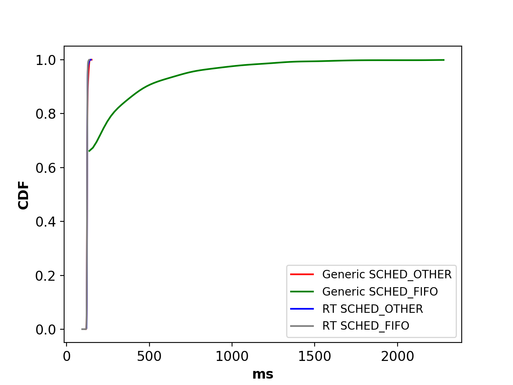
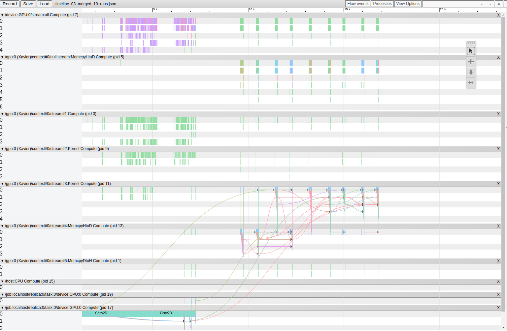

# Docker ROS Analysis Report

## 1. Overview

With the development of the Internet of things and artificial intelligence, terabytes of data is generated at the edge and needs to be processed in real-time. Edge computing has been proposed to address the latency and bandwidth issues. In this project, we set up experiments with Docker containers and ROS for real-time processing of sensor data. Several ROS applications including object detection, image classification, and handwritten digit classification are deployed to measure the latency, system utilization, and energy consumption of the devices.

## 2. Experiment setup

NVIDIA Jetson AGX Xavier is used to conduct all the experiments. Here are the system configurations of the two Jetson AGX boards used for the experiments. Jetpack is used to flash the host system and we apply RT kernel patches to one of the boards. Inside the AGX board, Docker is used as the running environment for ROS applications.  I built a Docker image with ROS 1.0 running inside.  The versions for CUDA, OpenCV, TensorFlow, and ROS are shown in the above table.

Four ROS applications are set up for the experiments:  YOLO v3 based object detection, MobileNet-SSD v1 based object detection, image classification, and MNIST handwritten digit classification. Besides, several tools are used to collect the logs to measure the latency, CPU/GPU/memory utilization, and energy consumption. The docker stats command is used to get the CPU and memory usage of the running container. NVIDIA Jetson tegrastats is used to collect the usage and frequency of CPU, GPU, memory, etc. 

| Property 	| Jetson AGX-1 	| Jetson AGX-2 	|
|:-:	|:-:	|:-:	|
| Kernel 	| 4.9.140-tegra 	| 4.9.140-rt93-tegra 	|
| JetPack 	| 4.4 	| 4.4 	|
| CUDA 	| 10.2 	| 10.2 	|
| OpenCV 	| 3.4.0 	| 3.4.0 	|
| TensorFlow 	| 1.15.2 	| 1.15.2 	|
| ROS 	| 1.0 (Melodic) 	| 1.0 (Melodic) 	|

The setup notes can be found at: https://github.com/waggle-sensor/summer2020/tree/master/liu/doc. 

## 3. Yolov3 under different power modes

There are seven power modes in AGX Xavier, the detailed descriptions of power budget, online CPU cores, CPU/GPU maximum frequency, GPU TPC (Texture Processor Cluster), and etc are shown in Table 2. We can find the MAXN mode (mode 0) has the best performance.

| Mode 	| MAXN 	| 10W 	| 15W * 	| 30W 	| 30W 	| 30W 	| 30W 	|
|:-:	|:-:	|:-:	|:-:	|:-:	|:-:	|:-:	|:-:	|
| Power budget 	| n/a 	| 10W 	| 15W 	| 30W 	| 30W 	| 30W 	| 30W 	|
| Mode ID 	| 0 	| 1 	| 2 	| 3 	| 4 	| 5 	| 6 	|
| Online CPU 	| 8 	| 2 	| 4 	| 8 	| 6 	| 4 	| 2 	|
| CPU maximal frequency (MHz) 	| 2265.6 	| 1200 	| 1200 	| 1200 	| 1450 	| 1780 	| 2100 	|
| GPU TPC 	| 4 	| 2 	| 4 	| 4 	| 4 	| 4 	| 4 	|
| GPU maximal frequency (MHz) 	| 1377 	| 520 	| 670 	| 900 	| 900 	| 900 	| 900 	|
| DLA cores 	| 2 	| 2 	| 2 	| 2 	| 2 	| 2 	| 2 	|
| DLA maximal frequency 	| 1395.2 	| 550 	| 750 	| 1050 	| 1050 	| 1050 	| 1050 	|
| PVA cores 	| 2 	| 0 	| 1 	| 1 	| 1 	| 1 	| 1 	|
| PVA maximal frequency 	| 1088 	| 0 	| 550 	| 760 	| 760 	| 760 	| 760 	|
| Memory maximal frequency (MHz) 	| 2133 	| 1066 	| 1333 	| 1600 	| 1600 	| 1600 	| 1600 	|

### 3.1 End-to-End Latency

For YOLO v3 based object detection, the message pipeline of the data sharing demo in ROS is shown in Figure 1. A router is used to collect devices because the transmission of ROS messages across multiple machines requires them to be under the same LAN.

The whole application starts with a ROS node /usb_cam capturing images from the USB camera, then images will be published to the system using ROS messages (called /usb_cam/image_raw). Another ROS node called /darknet_ros is launched which subscribes to the image topic and executes model inference of YOLO v3 model for object detection. The detection results as well as the raw images are published out for the access of other processes or other machines. 


End-to-End latency is defined as the total time consumption from the start time of capturing an image frame to the end time of getting detection results and publishing the results out. Here we repeated the experiments under different power modes and the CDF of the end-to-end latency is shown in Figure 3. We can find that power mode 0 has the best performance compared with others. 

CDF with Power Modes             |  CDF with USB camera and image file
:-------------------------:|:-------------------------:
  |  

| Power Mode 	| Max (ms) 	| Min (ms) 	| max-min (ms) 	| Average (ms) 	|
|:-:	|:-:	|:-:	|:-:	|:-:	|
| 0 	| 155 	| 115 	| 40 	| 127 	|
| 1 	| 640 	| 458 	| 182 	| 484 	|
| 2 	| 296 	| 205 	| 91 	| 228 	|
| 3 	| 208 	| 164 	| 44 	| 177 	|
| 4 	| 225 	| 163 	| 62 	| 175 	|
| 5 	| 195 	| 169 	| 26 	| 175 	|
| 6 	| 217 	| 161 	| 56 	| 184 	|

### 3.2 System Resource Utilization
| Power mode 	| CPU (% / freq) 	| GPU (% / freq) 	| Memory (%) 	|
|:-:	|:-:	|:-:	|:-:	|
| 0 	| 70.02 / 2263 	| 99 / 1377 	| 3.58 	|
| 1 	| 39.11 / 1190 	| 99 / 522 	| 3.32 	|
| 2 	| 71.62 / 1190 	| 99 / 675 	| 3.74 	|
| 3 	| 85.41 / 1190 	| 99 / 905 	| 3.56 	|
| 4 	| 74.73 / 1420 	| 99 / 905 	| 3.61 	|
| 5 	| 62.64 / 1803 	| 99 / 905 	| 3.48 	|
| 6 	| 54.83 / 2112 	| 99 / 905 	| 3.43 	|

### 3.3 Power Dissipation

An example of the tegrastats output:
```
RAM 10881/31919MB (lfb 4230x4MB) SWAP 0/15959MB (cached 0MB) CPU [17%@1190,17%@1190,18%@1190,25%@1190,17%@1336,15%@1340,23%@1543,15%@1574] EMC_FREQ 55%@2133 GR3D_FREQ 95%@1377 APE 150 MTS fg 0% bg 10% AO@48C GPU@54.5C Tdiode@53.25C PMIC@100C AUX@46C CPU@49C thermal@49.45C Tboard@47C GPU 18401/18525 CPU 2301/2330 SOC 4602/4602 CV 0/0 VDDRQ 2914/2911 SYS5V 4632/4620
```

The description of the power values:
| Rail Name 	| Description 	|
|:-:	|:-:	|
| Channel 0: GPU 	| GPU power rail 	|
| Channel 1: CPU 	| CPU power rail 	|
| Channel 2: SOC 	| SoC power rail 	|
| Channel 0: CV 	| CV power rail 	|
| Channel 1: VDDRQ 	| DDR power rail 	|
| Channel 2: SYS5V 	| System 5V power rail 	|

The average power dissipation at runtime:
| Power (mW) 	| CPU 	| GPU 	| SoC 	| DDR 	| SYS 	| Sum 	|
|:-:	|:-:	|:-:	|:-:	|:-:	|:-:	|-	|
| mode 0 	| 2330 	| 18525 	| 4602 	| 2911 	| 4620 	| 32988 	|
| mode 1 	| 510 	| 2375 	| 1550 	| 1196 	| 3210 	| 8841 	|
| mode 2 	| 768 	| 5075 	| 2011 	| 2004 	| 3630 	| 13488 	|
| mode 3 	| 952 	| 7429 	| 2816 	| 2336 	| 4039 	| 17572 	|
| mode 4 	| 983 	| 7389 	| 2594 	| 2332 	| 4034 	| 17332 	|
| mode 5 	| 1369 	| 6958 	| 2480 	| 2245 	| 3988 	| 17040 	|
| mode 6 	| 1326 	| 6997 	| 2483 	| 2271 	| 3999 	| 17076 	|


## 4. Comparisons of Generic/RT Kernels

### 4.1 Yolov3 object detection


System resource utilization:
| Kernels 	| CPU (% / freq) 	| GPU (% / freq) 	| Memory (%) 	|
|:-:	|:-:	|:-:	|:-:	|
| Generic 	| 70.02 / 2265 	| 99 / 1377  	| 3.58 	|
| RT 	| 55.31 / 2265 	| 99 / 1377 	| 3.44 	|

Power dissipation:
| Power (mW) 	| CPU 	| GPU 	| SoC 	| DDR 	| SYS 	| Sum 	|
|:-:	|:-:	|:-:	|:-:	|:-:	|:-:	|-	|
| Generic 	| 2330 	| 18525 	| 4602 	| 2911 	| 4620 	| 32988 	|
| RT 	| 2312 	| 19050 	| 4962 	| 2756 	| 4885 	| 33965 	|

### 4.2 Cyclictest

Cyclictest accurately and repeatedly measures the difference between a thread's intended wake-up time and the time at which it actually wakes up in order to provide statistics about the system's latencies. It can measure latencies in real-time systems caused by the hardware, the firmware, and the operating system.

#### 4.2.1 Generic kernel

```
nvidia@nvidia-desktop:~/projects/rt-tests$ sudo ./cyclictest --mlockall --smp --priority=80 --interval=200 --distance=0
# /dev/cpu_dma_latency set to 0us
policy: fifo: loadavg: 1.04 0.74 0.61 3/1212 8147           

T: 0 ( 8137) P:80 I:200 C:  73055 Min:      7 Act:   13 Avg:   15 Max:     151
T: 1 ( 8138) P:80 I:200 C:  73040 Min:      7 Act:   18 Avg:   15 Max:     125
T: 2 ( 8139) P:80 I:200 C:  73004 Min:      7 Act:   39 Avg:   14 Max:    1076
T: 3 ( 8140) P:80 I:200 C:  72989 Min:      6 Act:   48 Avg:   14 Max:     141
```

#### 4.2.2 RT kernel
```
nvidia@nvidia-xavier-rt:~/projects/rt-tests$ uname -a
Linux nvidia-xavier-rt 4.9.140-rt93-tegra #1 SMP PREEMPT RT Wed Jun 3 16:58:57 EDT 2020 aarch64 aarch64 aarch64 GNU/Linux

nvidia@nvidia-xavier-rt:~/projects/rt-tests$ sudo ./cyclictest --mlockall --smp --priority=80 --interval=200 --distance=0
# /dev/cpu_dma_latency set to 0us
policy: fifo: loadavg: 0.34 0.61 0.60 1/1238 8573           

T: 0 ( 8565) P:80 I:200 C:  18697 Min:      4 Act:    7 Avg:    8 Max:     116
T: 1 ( 8566) P:80 I:200 C:  18669 Min:      4 Act:    9 Avg:    7 Max:      49
T: 2 ( 8567) P:80 I:200 C:  18673 Min:      3 Act:    7 Avg:    7 Max:     109
T: 3 ( 8568) P:80 I:200 C:  18660 Min:      4 Act:    6 Avg:    7 Max:      45
T: 4 ( 8569) P:80 I:200 C:  18648 Min:      4 Act:    5 Avg:    8 Max:      83
T: 5 ( 8570) P:80 I:200 C:  18635 Min:      4 Act:    7 Avg:    7 Max:      46
T: 6 ( 8571) P:80 I:200 C:  18623 Min:      4 Act:    6 Avg:    7 Max:      43
T: 7 ( 8572) P:80 I:200 C:  18611 Min:      4 Act:    6 Avg:    7 Max:      50
```

## 5. Pressure Test under Generic / RT Kernels

Data Pipeline             |  CDF under generic and RT kernel
:-------------------------:|:-------------------------:
  |  

### 5.1 End-to-End Latency

| Kernel 	| Max (ms) 	| Min (ms) 	| max-min (ms) 	| Average (ms) 	|
|:-:	|:-:	|:-:	|:-:	|:-:	|
| Generic 	| 1403 	| 117 	| 1286 	| 166 	|
| RT 	| 258 	| 130 	| 128 	| 175 	|

### 5.2 System Resource Utilization

| Kernels 	| CPU (% / freq) 	| GPU (% / freq) 	| Memory (%) 	|
|:-:	|:-:	|:-:	|:-:	|
| Generic 	| 250.6 / 2265 	| 99 / 1377  	| 12.82 	|
| RT 	| 258.29 / 2265 	| 99 / 1377 	| 16.18 	|

### 5.3 Power Dissipation

Pressure test results:
| Power (mW) 	| CPU 	| GPU 	| SoC 	| DDR 	| SYS 	| Sum 	|
|:-:	|:-:	|:-:	|:-:	|:-:	|:-:	|:-:	|
| Generic 	| 5595 	| 17109 	| 4780 	| 2877 	| 4621 	| 34982 	|
| RT 	| 5855 	| 14919 	| 4690 	| 2466 	| 4817 	| 32747 	|

Single test with Yolov3 results:
| Power (mW) 	| CPU 	| GPU 	| SoC 	| DDR 	| SYS 	| Sum 	|
|:-:	|:-:	|:-:	|:-:	|:-:	|:-:	|-	|
| Generic 	| 2330 	| 18525 	| 4602 	| 2911 	| 4620 	| 32988 	|
| RT 	| 2312 	| 19050 	| 4962 	| 2756 	| 4885 	| 33965 	|


## Runtime Scheduling Configuration Analysis

Power Analysis             |  CDF with Runtime Scheduling Config
:-------------------------:|:-------------------------:
  |  


## Timeline and breakdown

Single model inference:


10 model inference:


yolov3:
```
node name                   requested bytes                  total execution time            accelerator execution time       cpu execution time
Conv2D                      1015.29MB (100.00%, 61.17%),     215.96ms (100.00%, 74.32%),     170.59ms (100.00%, 82.80%),      45.37ms (100.00%, 53.65%)
LeakyRelu                             0B (0.00%, 0.00%),        11.97ms (25.68%, 4.12%),         5.42ms (17.20%, 2.63%),         6.56ms (46.35%, 7.75%)
FusedBatchNormV3                      0B (0.00%, 0.00%),         9.79ms (21.56%, 3.37%),         5.94ms (14.57%, 2.88%),         3.85ms (38.59%, 4.56%)
AddV2                                 0B (0.00%, 0.00%),         5.02ms (18.19%, 1.73%),         3.34ms (11.69%, 1.62%),         1.68ms (34.04%, 1.99%)
Tile                           114.69KB (38.83%, 0.01%),         4.35ms (16.46%, 1.50%),          838us (10.07%, 0.41%),         3.52ms (32.05%, 4.16%)
import/conv68/Conv2D-0-TransposeNHWCToNCHW-LayoutOptimizer        2.77MB (38.82%, 0.17%),         3.04ms (14.96%, 1.04%),            57us (9.66%, 0.03%),         2.98ms (27.89%, 3.52%)
ConcatV2                        10.51MB (38.65%, 0.63%),         2.54ms (13.92%, 0.88%),           947us (9.63%, 0.46%),         1.60ms (24.37%, 1.89%)
StridedSlice                     3.62MB (38.02%, 0.22%),         1.63ms (13.05%, 0.56%),           166us (9.17%, 0.08%),         1.46ms (22.48%, 1.73%)
```

The detailed logs of the breakdown can be found at: https://github.com/waggle-sensor/summer2020/blob/master/liu/Perf-Profiling-Docker-ROS_1/timeline_analysis-TF/tf_time_breakdown.log.


## Reference
 - https://docs.nvidia.com/jetson/archives/l4t-archived/l4t-3231/index.html#page/Tegra%20Linux%20Driver%20Package%20Development%20Guide/AppendixTegraStats.html
 - https://docs.nvidia.com/jetson/l4t/index.html#page/Tegra%20Linux%20Driver%20Package%20Development%20Guide/power_management_jetson_xavier.html
 - https://wiki.linuxfoundation.org/realtime/documentation/howto/tools/cyclictest/start
 - https://docs.nvidia.com/jetson/archives/l4t-archived/l4t-322/index.html#page/Tegra%2520Linux%2520Driver%2520Package%2520Development%2520Guide%2Fpower_management_jetson_xavier.html%23wwpID0E0LF0HA
 - https://github.com/tensorflow/tensorflow/blob/r1.15/tensorflow/core/profiler/g3doc/python_api.md
