# ROS2 Profiling Report

## Experiment Setup

| Property 	| Jetson AGX-1 	| Jetson AGX-2 	|
|:-:	|:-:	|:-:	|
| Kernel 	| 4.9.140-tegra 	| 4.9.140-rt93-tegra 	|
| JetPack 	| 4.4-DP 	| 4.4-DP 	|
| CUDA 	| 10.2 	| 10.2 	|
| OpenCV 	| 3.4.0 	| 3.4.0 	|
| TensorFlow 	| 1.15.2 	| 1.15.2 	|
| ROS 	| 2.0 (Dashing) 	| 2.0 (Dashing) 	|

## 3. Yolov3 with ROS1 and ROS2

### 3.1 End-to-End Latency

CDF              |  CDF        | CDF              |
:-------------------------:|:-------------------------:|:-------------------------:
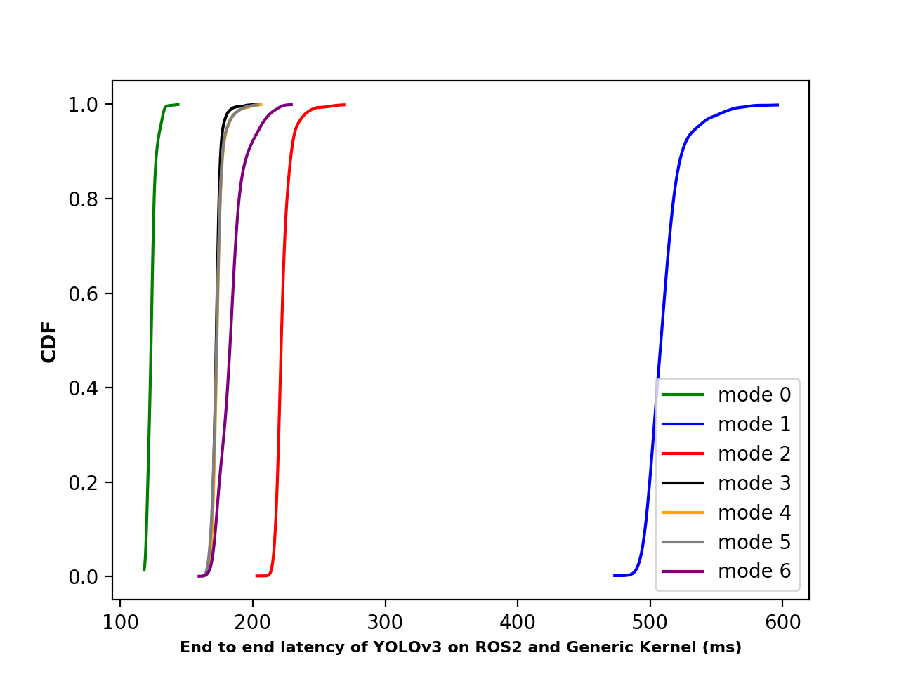  |  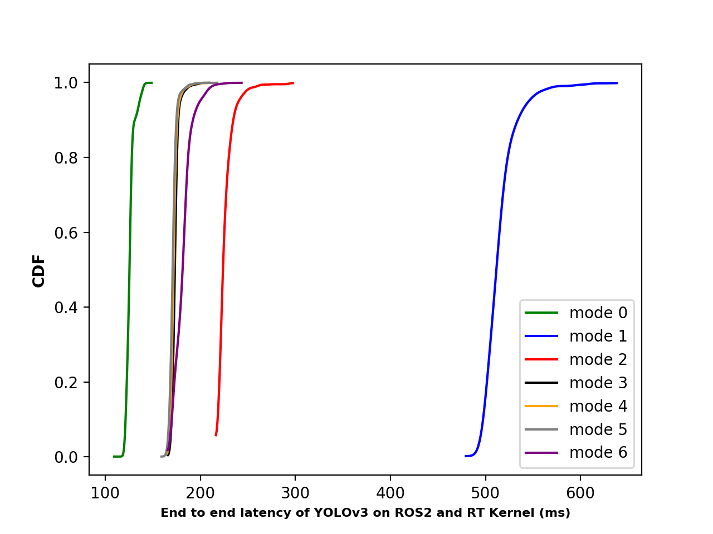 | 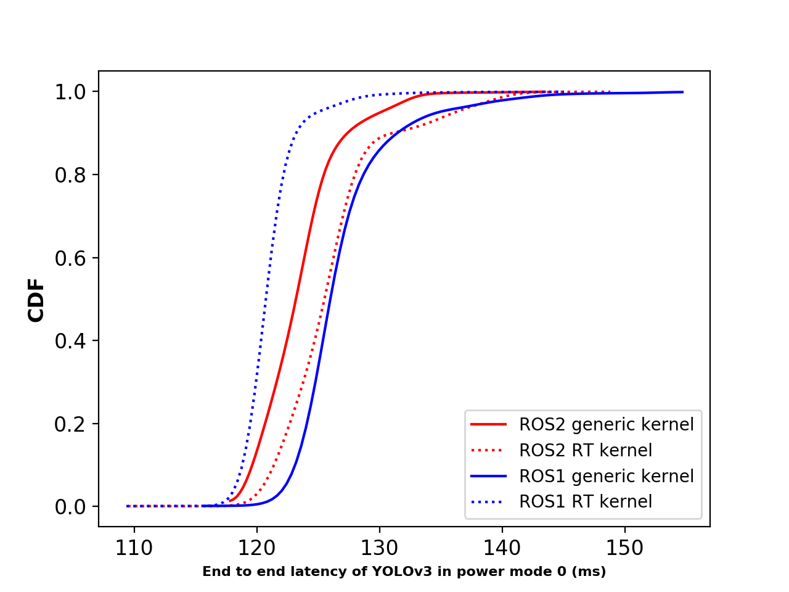
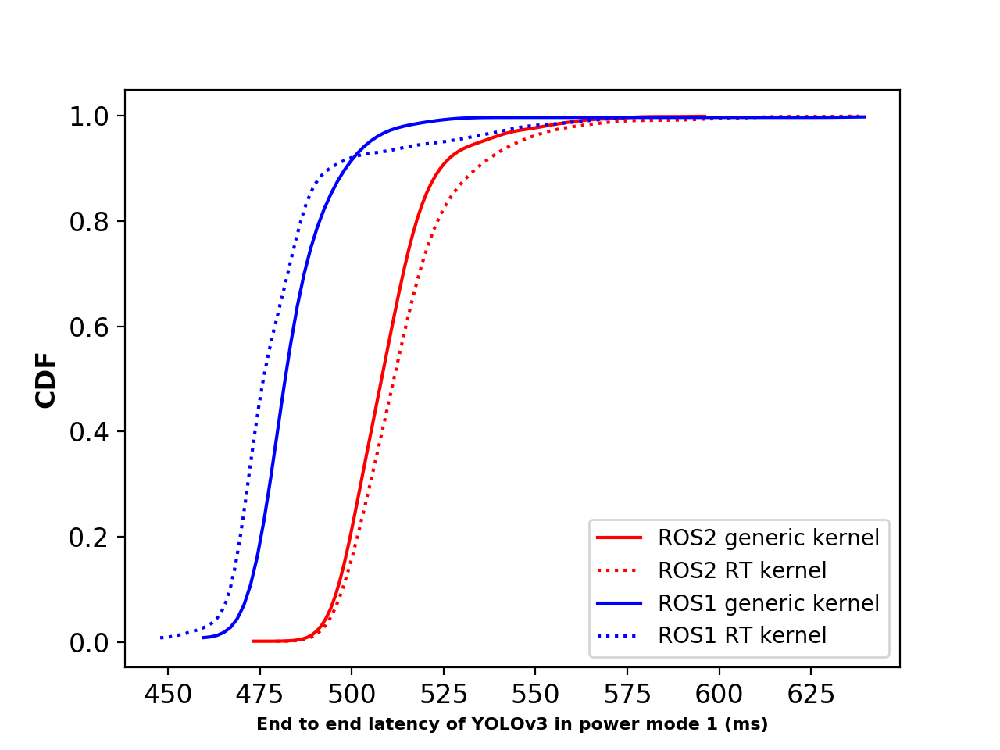  |  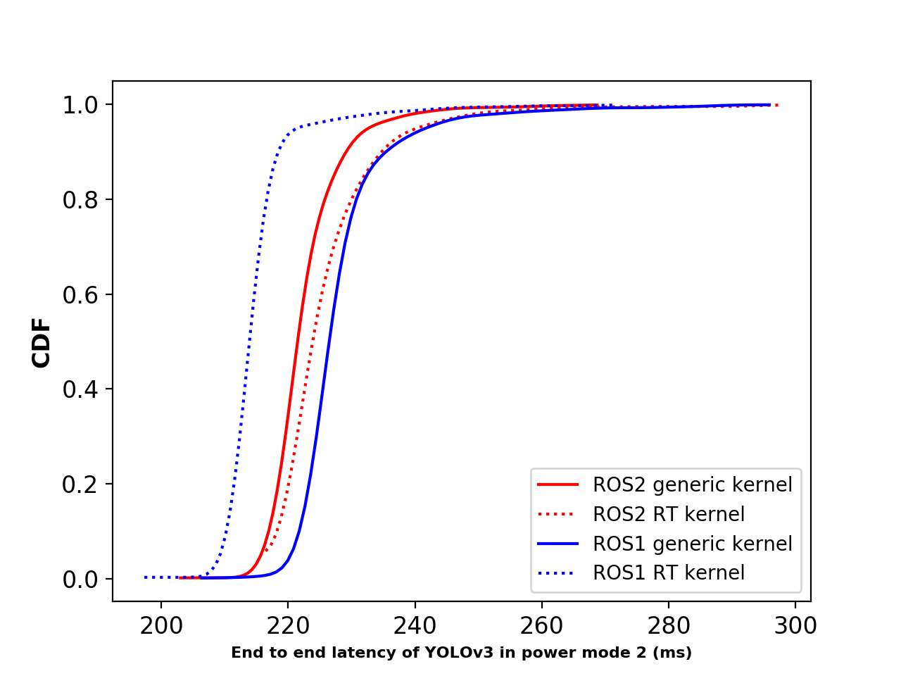 |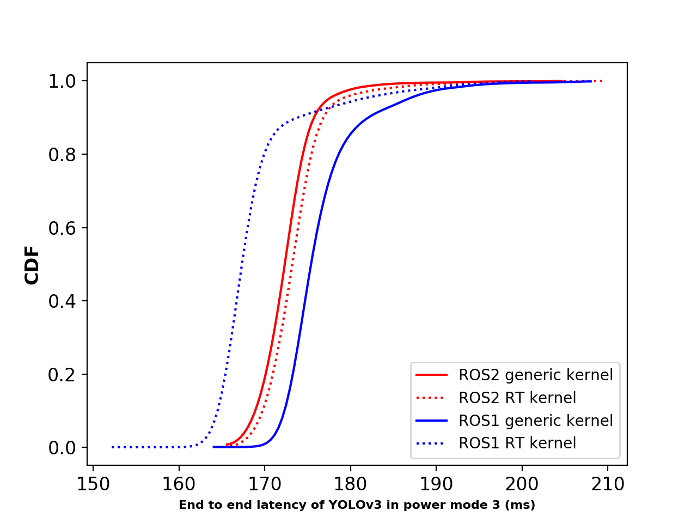
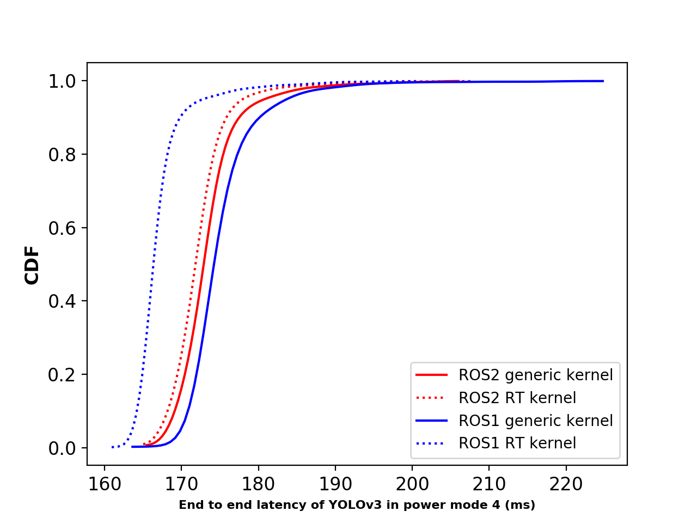  |  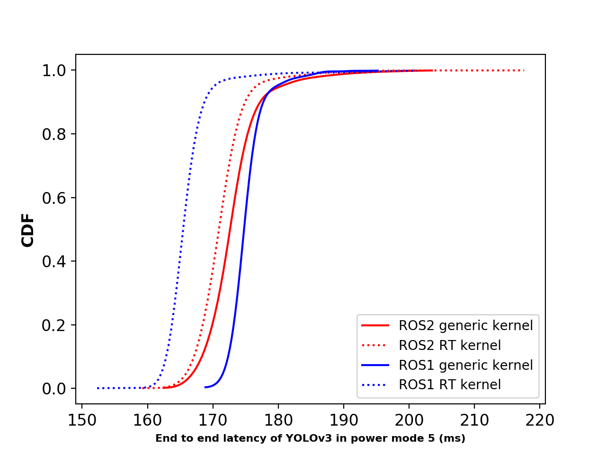 |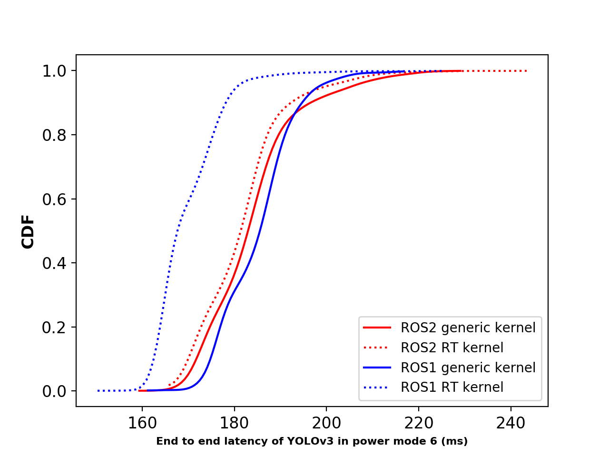

### 3.2 System Resource Utilization

#### 3.2.1 CPU utilization

| Power mode 	| ROS1 Generic (% / freq) 	| ROS2 Generic (% / freq) 	| ROS1 RT (% / freq) 	| ROS2 RT (% / freq) 	|
|:-:	|:-:	|:-:	|:-:	|:-:	|
| mode 0 	| 70.02 / 2263 	| 59.64 / 2265 	| 54.76 / 2265 	| 69.16 / 2265 	|
| mode 1 	| 39.11 / 1190 	| 56.42 / 1190 	| 39.10 / 1190 	| 64.19 / 1190 	|
| mode 2 	| 71.62 / 1190 	| 79.35 / 1190 	| 68.58 / 1190 	| 87.75 / 1190 	|
| mode 3 	| 85.41 / 1190 	| 93.68 / 1190 	| 85.12 / 1190 	| 98.15 / 1190 	|
| mode 4 	| 74.73 / 1420 	| 81.95 / 1420 	| 71.68 / 1420 	| 84.89 / 1420 	|
| mode 5 	| 62.64 / 1803 	| 69.18 / 1803 	| 62.73 / 1804 	| 66.46 / 1804 	|
| mode 6 	| 54.83 / 2112 	| 61.38 / 2112 	| 52.35 / 2112 	| 62.23 / 2112 	| 

#### 3.2.1 GPU utilization

| Power mode 	| ROS1 Generic (% / freq) 	| ROS2 Generic (% / freq) 	| ROS1 RT (% / freq) 	| ROS2 RT (% / freq) 	|
|:-:	|:-:	|:-:	|:-:	|:-:	|
| mode 0 	| 99 / 1377 	| 99 / 1377 	| 99 / 1377 	| 99 / 1377 	|
| mode 1 	| 99 / 522 	| 99 / 522 	| 99 / 522 	| 99 / 522 	|
| mode 2 	| 99 / 675 	| 99 / 675 	| 99 / 675 	| 99 / 675 	|
| mode 3 	| 99 / 905 	| 99 / 905 	| 99 / 905 	| 99 / 905 	|
| mode 4 	| 99 / 905 	| 99 / 905 	| 99 / 905 	| 99 / 905 	|
| mode 5 	| 99 / 905 	| 99 / 905 	| 99 / 905 	| 99 / 905 	|
| mode 6 	| 99 / 905 	| 99 / 905 	| 99 / 905 	| 99 / 905 	| 

#### 3.2.1 Memory utilization

| Power mode 	| ROS1 Generic (%) 	| ROS2 Generic (%) 	| ROS1 RT (%) 	| ROS2 RT (%) 	|
|:-:	|:-:	|:-:	|:-:	|:-:	|
| mode 0 	| 3.58 	| 3.52 	| 3.47 	| 3.22 	|
| mode 1 	| 3.32 	| 3.04 	| 3.59 	| 3.15 	|
| mode 2 	| 3.74 	| 3.43 	| 3.52 	| 2.99 	|
| mode 3 	| 3.56 	| 3.71 	| 3.46 	| 2.98 	|
| mode 4 	| 3.61 	| 3.74 	| 3.49 	| 3.10 	|
| mode 5 	| 3.48 	| 3.67 	| 3.47 	| 3.07 	|
| mode 6 	| 3.43 	| 3.38 	| 3.50 	| 3.12 	|

### 3.3 Power Dissipation

#### Generic kernel

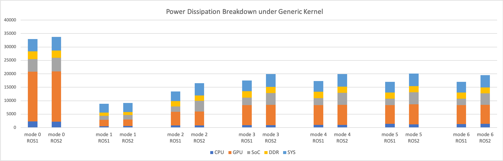

#### RT kernel

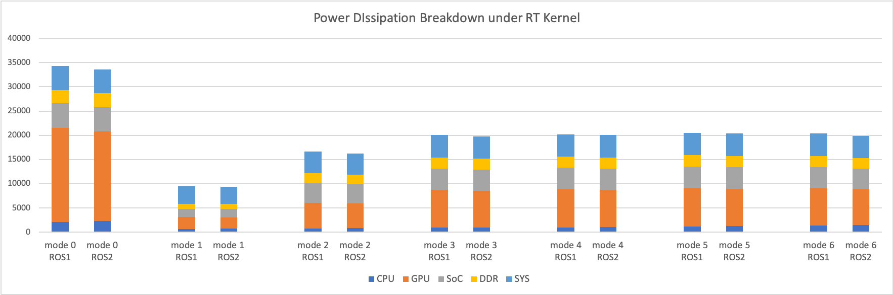
