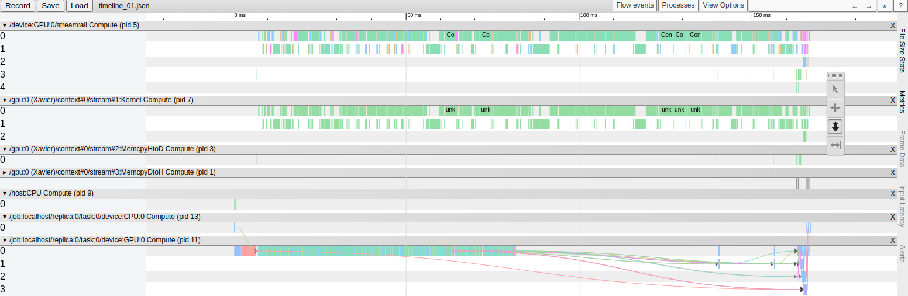
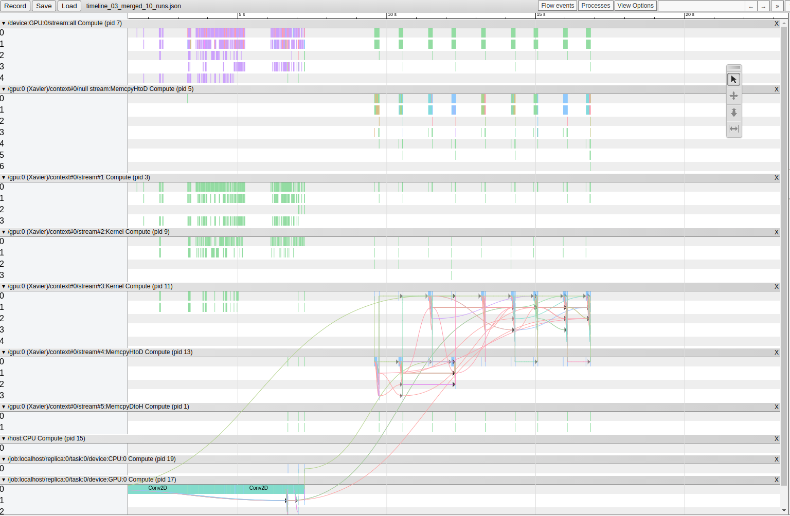

# Daily Notes - Liangkai Liu

## Week 1 (May 4 to May 8)

### May 4 to May 7, 2020
#### Work Done:

**Prototype Setup:** set up a prototype with a Leopard HD camera and a Velodyne VLP16 LiDAR. 
* system configurations
	* Ubuntu 18.04
	* CUDA 10.0
  * TensorFlow 1.14.0
  * OpenCV 3.3.1
  * ROS 1.0 Melodic
  * ...

**Demos on the image/LiDAR point cloud processing**
* four demos: 
  * object detection on USB camera
  * LiDAR point cloud capturing and viewing
  * LiDAR point cloud segmentation
  * calibration of LiDAR and camera

**Report Link:** https://docs.google.com/document/d/14qHXLcrpSZkLaF3EGXZMHhy75IStIEFUl-iIESRkvUw/edit?usp=sharing

#### To Do List:
* solve the sychronization issue of message from Velodyne LiDAR
* get the calibration result of LiDAR point cloud and camera image
* try more state-of-the-art works on LiDAR/Camera data processing to understand the system requirements

### May 8, 2020
#### Work Done: 
Solve the sychronization issue of message from Velodyne LiDAR. It turns out to be the problem of the driver. Right now the message -/velodyne_points- has the time read from the system clock. **Time sychronization** can be an important issue when multiple sensors need to be used together for some applications. Two things to consider for time sychronization. One is the sychronization granunarity (second/millisecond/microsecond levels), which is mainly determined by the application. The other is how to get "true" time, potential solution is NTP-based or GPS/GNSS-based. 

**object detection using LiDAR point cloud**

**PCDet**: rank #1 on KITTI 3D object detection (http://www.cvlibs.net/datasets/kitti/eval_object.php?obj_benchmark=3d)
depends on SpConv1.0 (https://github.com/traveller59/spconv/tree/8da6f967fb9a054d8870c3515b1b44eca2103634), which needs cmake3.13.2+ (ref: https://askubuntu.com/questions/355565/how-do-i-install-the-latest-version-of-cmake-from-the-command-line)

**system requirements to enable Waggle for multi-sensor processing**
 * time sychronization
 * concurrent access to the sensor data (multi-process access the same sensor at the same time)
 * frequency issue: different sensor has different FPS, for example camera has 30 or 60 FPS, LiDAR has 10 FPS. The time to capture a frame/point cloud data from the sensor also vary within a small range. How to manage these issues?
 * to be added .......

#### To Do List:
* calibration result of LiDAR point cloud and camera image
* set up application on transforming point cloud to panorama image
* set up application on using point cloud or the panorama from LiDAR for object detection

## Week 2 (May 11 to May 15)

### May 11, 2020
#### Work Done: 

**object detection using LiDAR point cloud**

Set up dependencies including SpConv1.0 and cmake for PCDet. Issue comes out when install other requirements including numba, tensorboardX, easydict, pyyaml, scikit-image, and tqdm. Use conda install numpy. Issues remain when install others.Issues with the Jetson TX2 board. On another NVIDIA GPU clsuter machine, successfully set up the PCDet.

**system dependency:** an important issue for the deployment of multi-sensor applications. For deep learning-based applications, CUDA, TensorFlow, Torch, cmake, gcc/g++, and other libraries' version need to configure in advance.

#### To Do List:
* Solve the issue on Jetson TX2 and get the object detection using point cloud
* experiments with some results to show the time synchronization, concurrency issues with ROS

### May 12, 2020
#### Work Done: 

**attend the SAGE workshop:** Understand the vision of the SAGE project and its deliverable plan. The presentations have covered questions like how to prepare dataset with labels for the training of DNN models, SAGE programming model with scheudling APIs, edge code repository, the data path from edge to cloud, training data collection, and SAGE data object storage.

#### To Do List:
* Learn related slides and try to understand the objective as well as specific tasks of system support for multi-sensor processing at the edge 
* Set up apps for experiments for using ROS in multi-sensor processing

### May 13, 2020
#### Work Done:
work on experiments of several process (ROS node) subscribe to the same image/point cloud data. Proflile the memory footprint, CPU usage, GPU usage, and power consumption.

**object detection using LiDAR point cloud:** set up point cloud-based object detection demo (PCDet) on a GPU cluster. The training data includes image, calibration data, point cloud, and label.


#### To Do List:
* Finish the experiments in ROS and get a analysis report
* Get a design/plan of the work on optimization


### May 14, 2020
#### Work Done:
Discuss to get the plan for the next two weeks. There will be two specific things: compare the performace in terms of latency, accuracy time, etc of Docker with ROS under Real-Time Kernel and generic kernel; data sharing of images/messages between dockers. After that, I have built a Docker image with ROS based on the image containing machine learning tools.

#### To Do List:
* Implement Real-Time Kernel on Jetson board
* Do experiments using generic kernel with applications running on Docker with ROS

### May 15, 2020
#### Work Done:
 * Set up Real-time kernel patch for Ubuntu 18.04 on Nvidia Jetson TX2. (Ref link: https://stackoverflow.com/questions/51669724/install-rt-linux-patch-for-ubuntu)
 * Set up object detection demo using image in the Docker image
 * Experiments to see the performance of obejct detection demo on generic kernel

#### To Do List:
* Set up generic kernel on Nvidia AGX Xavier board
* Explore the measure tools for the profiling of the application

## Week 3 (May 18 to May 22)

### May 18, 2020
#### Work Done:
 * Set up the docker container with ROS and object detection demo, the set up notes can be find at https://docs.google.com/document/d/1cW1deiGM4HMRzKKOMZVZCw9Ns_-ZDOfSTMaQvUUyjaA/edit?usp=sharing
 * Flash Nvidia AGX Xavier with Ubuntu 18.04 and RT-kernel

#### To Do List:
* Set up generic kernel on Nvidia AGX Xavier board
* Get applications running within the Docker

### May 19, 2020
#### Work Done:
 * Face a no space issue after buinding the Docker image on Jetson TX2 board. On another Intel-based device, make the docker image but the architecture is x86-64, which cannot run on Jetson AGX Xavier (arm64). Get a new Nvidia AGX Xavier and launch the docker container and commit the changes to a new docker image named plugin-tensorflow-ros. There is another issue come out. which shows that "CUDA driver is not sufficient with run environment".

#### To Do List:
* Solve the CUDA drivier version issue
* Get applications running within the Docker

### May 20, 2020
#### Work Done:
 * Try to install all ROS-related packdges on base docker image from Nvidia (https://ngc.nvidia.com/catalog/containers/nvidia:l4t-tensorflow). The CUDA driver issue is solved. Another issue realted to OpenCV 4.x comes out, which is because the OpenCV 4.x requires C++ 11+ support. The demo can works with CUDA 10.0 and OpenCV 3.3.1 on Jetson TX2.

#### To Do List:
* Get applications running within the Docker
* Try install generic kernel patch into Nvidia Jetson AGX board

### May 21, 2020
#### Work Done:
 * Try to solve the OpenCV 4.x dependency issue
 * Implement the new docker image from Nvidia on Jetson AGX and built ROS into it
 * Try to install generic kernel on the Nvidia Jetson AGX Xavier

OpenCV4 issue with ROS:
```
nvidia@nvidia-desktop:~$ sudo docker run -it plugin-tensorflow-ros /bin/bash
[sudo] password for nvidia: 
root@e2e7604628c5:/# roslaunch darknet_ros 
darknet_ros.launch      object_detection.test   
darknet_ros_gdb.launch  yolo_v3.launch          
root@e2e7604628c5:/# roslaunch darknet_ros 
darknet_ros.launch      object_detection.test   
darknet_ros_gdb.launch  yolo_v3.launch          
root@e2e7604628c5:/# roslaunch darknet_ros darknet_ros.launch 
... logging to /root/.ros/log/5ab37520-9c47-11ea-a3ab-0242ac110002/roslaunch-e2e7604628c5-211.log
Checking log directory for disk usage. This may take a while.
Press Ctrl-C to interrupt
Done checking log file disk usage. Usage is <1GB.

started roslaunch server http://e2e7604628c5:35317/

SUMMARY
========

PARAMETERS
 * /darknet_ros/actions/camera_reading/name: /darknet_ros/chec...
 * /darknet_ros/config_path: /root/catkin_ws/s...
 * /darknet_ros/image_view/enable_console_output: True
 * /darknet_ros/image_view/enable_opencv: True
 * /darknet_ros/image_view/wait_key_delay: 1
 * /darknet_ros/publishers/bounding_boxes/latch: False
 * /darknet_ros/publishers/bounding_boxes/queue_size: 1
 * /darknet_ros/publishers/bounding_boxes/topic: /darknet_ros/boun...
 * /darknet_ros/publishers/detection_image/latch: True
 * /darknet_ros/publishers/detection_image/queue_size: 1
 * /darknet_ros/publishers/detection_image/topic: /darknet_ros/dete...
 * /darknet_ros/publishers/object_detector/latch: False
 * /darknet_ros/publishers/object_detector/queue_size: 1
 * /darknet_ros/publishers/object_detector/topic: /darknet_ros/foun...
 * /darknet_ros/subscribers/camera_reading/queue_size: 1
 * /darknet_ros/subscribers/camera_reading/topic: /camera/rgb/image...
 * /darknet_ros/weights_path: /root/catkin_ws/s...
 * /darknet_ros/yolo_model/config_file/name: yolov2-tiny.cfg
 * /darknet_ros/yolo_model/detection_classes/names: ['person', 'bicyc...
 * /darknet_ros/yolo_model/threshold/value: 0.3
 * /darknet_ros/yolo_model/weight_file/name: yolov2-tiny.weights
 * /rosdistro: melodic
 * /rosversion: 1.14.5

NODES
  /
    darknet_ros (darknet_ros/darknet_ros)

auto-starting new master
process[master]: started with pid [221]
ROS_MASTER_URI=http://localhost:11311

setting /run_id to 5ab37520-9c47-11ea-a3ab-0242ac110002
process[rosout-1]: started with pid [232]
started core service [/rosout]
process[darknet_ros-2]: started with pid [238]
[ INFO] [1590164093.347287816]: [YoloObjectDetector] Node started.
[ INFO] [1590164093.363454414]: [YoloObjectDetector] Xserver is not running.
[ INFO] [1590164093.375057429]: [YoloObjectDetector] init().
YOLO V3
layer     filters    size              input                output
    0 CUDA Error: CUDA driver version is insufficient for CUDA runtime version
CUDA Error: CUDA driver version is insufficient for CUDA runtime version: Resource temporarily unavailable
[darknet_ros-2] process has died [pid 238, exit code 255, cmd /root/catkin_ws/devel/lib/darknet_ros/darknet_ros camera/rgb/image_raw:=/camera/rgb/image_raw __name:=darknet_ros __log:=/root/.ros/log/5ab37520-9c47-11ea-a3ab-0242ac110002/darknet_ros-2.log].
log file: /root/.ros/log/5ab37520-9c47-11ea-a3ab-0242ac110002/darknet_ros-2*.log
^C[rosout-1] killing on exit
[master] killing on exit
shutting down processing monitor...
... shutting down processing monitor complete
```
Nvidia Jetson docker link issue:
```
nvidia@nvidia-desktop:/usr/local/cuda-10.2/targets/aarch64-linux/lib$ sudo nvidia-container-cli -k -d /dev/tty info

-- WARNING, the following logs are for debugging purposes only --

I0522 15:58:24.937181 20852 nvc.c:281] initializing library context (version=1.1.1, build=e5d6156aba457559979597c8e3d22c5d8d0622db)
I0522 15:58:24.937470 20852 nvc.c:255] using root /
I0522 15:58:24.937503 20852 nvc.c:256] using ldcache /etc/ld.so.cache
I0522 15:58:24.937540 20852 nvc.c:257] using unprivileged user 65534:65534
W0522 15:58:24.938437 20852 nvc.c:171] failed to detect NVIDIA devices
I0522 15:58:24.939162 20853 nvc.c:191] loading kernel module nvidia
E0522 15:58:24.940468 20853 nvc.c:193] could not load kernel module nvidia
I0522 15:58:24.940512 20853 nvc.c:203] loading kernel module nvidia_uvm
E0522 15:58:24.941286 20853 nvc.c:205] could not load kernel module nvidia_uvm
I0522 15:58:24.941325 20853 nvc.c:211] loading kernel module nvidia_modeset
E0522 15:58:24.942163 20853 nvc.c:213] could not load kernel module nvidia_modeset
I0522 15:58:24.943107 20854 driver.c:101] starting driver service
E0522 15:58:24.943938 20854 driver.c:161] could not start driver service: load library failed: libnvidia-ml.so.1: cannot open shared object file: no such file or directory
I0522 15:58:24.944365 20852 driver.c:196] driver service terminated successfully
nvidia-container-cli: initialization error: driver error: failed to process request
```

#### To Do List:
* Try to solve the OpenCV4 issue and Nvidia Docker issue
* Try to get generic kernel patch

### May 22, 2020
#### Work Done:
* Flash several edge devices for experiments. Below is the table containing the linux and library version.

| Machine ID |         Device        | Ubuntu | CUDA | OpenCV | TensorFlow |
|:----------:|:---------------------:|:------:|:----:|:------:|:----------:|
|      1     |       Jetson TX2      |  18.04 | 10.0 |  3.2.0 |   1.15.0   |
|      2     |      AGX Xavier1      |  18.04 | 10.2 |  4.1.1 |      -     |
|      3     |      AGX Xavier2      |  18.04 | 10.2 |  4.1.1 |      -     |
|      4     | Intel Fog (CPU-based) |  18.04 |   -  |  4.2.0 |   1.14.0   |

 * Try the Yolov3 object detection demo (ROS Darknet: https://github.com/leggedrobotics/darknet_ros) on machine 1 and 2. 
 * Try Tensroflow object detection demo (https://tensorflow-object-detection-api-tutorial.readthedocs.io/en/latest/camera.html) on all four machines

#### To Do List:
* Investigate system level tools for profiling the application running on real-time/generic kernel
* Get generic kernel patch into Nvidia Jetson AGX board

## Week 4 (May 26 to May 29)

### May 26, 2020
#### Work Done:
* Solve several issues of running object detection demo in Docker+ROS, including cv_bridge with python3 issue, OpenCV4 with ROS issue, and cv_bridge with OpenCV4 issue. Details can be found at [ROS-Docker-Setup.pdf](https://github.com/waggle-sensor/summer2020/blob/master/liu/ROS-Docker%20Setup.pdf).

* Try RT kernel patch and generic kernel patch on AGX Xavier device

#### To Do List:
* Set up system level tools like perf, htop, and strace for profiling the application running on real-time/generic kernel

### May 27, 2020
#### Work Done:
* Solve dependency issues of running Darknet in Docker ROS and build the complete Docker image, currently the application is ready and the Docker image has been pushed onto Docker Hub. Some library versions that work well with ROS 1.0 Melodic are: CUDA 10.2, OpenCV 3.4.0, Python 3.6, and TensorFlow 1.15.2. The command to pull the Docker image (18GB):
```
docker pull liangkailiu/plugin-tensorflow-ros:v5
```
* Discuss with Raj and try RT kernel patch kernel patch on AGX Xavier device. The challenge is to find a propriate linux kernel with low latency or real-time patch but can build on arm64 architecture.

#### To Do List:
* Try and solve the issues while building premptive kernel patch for Nvidia AGX Xavier 
* Set up system level tools like perf, htop, and strace for profiling the application running on real-time/generic kernel

### May 28, 2020
#### Work Done:
* Try to build RT-kernel using corss-compile on an x86 machine (Ref: https://medium.com/@r7vme/real-time-kernel-for-nvidia-agx-xavier-b660e107a211) but gets some errors when impleemtning on Jetson AGX. The issues may be caused on the JetPack versions. 
* Finish the data sharing between Docker containers using ROS. There are two types of data sharing: between containers on the same device; between containers on two Jetson device. Setup details can be found at: https://docs.google.com/document/d/14_v1tB89duOA5YHmGE8Q24396NS8CckfU07jGvw7fPk/edit?usp=sharing. 

#### To Do List:
* Solve the issue of building RT kernel on Nvidia Jetson AGX
* Start the comparison experiments on Docker+ROS with generic/RT kernels

### May 29, 2020
#### Work Done:
* Prepare demo for the data sharing of ROS messages between Docker containers. Setup details can be found at: https://docs.google.com/document/d/14_v1tB89duOA5YHmGE8Q24396NS8CckfU07jGvw7fPk/edit?usp=sharing. The feature of data sharing between Docker containers is finished.
* Clean up notes for setting up ROS in Docker and achieving data sharing in Docker with ROS. The notes for Docker ROS setup can be found at [here](https://github.com/waggle-sensor/summer2020/blob/master/liu/Docker-ROS-Setup.md) and the notes for data sharing in Docker with ROS can be found at [here](https://github.com/waggle-sensor/summer2020/blob/master/liu/Docker-ROS-DataSharing.md).

#### To Do List:
* Solve the issue of building RT kernel on Nvidia Jetson AGX
* Experiments of the latency, system resource utilization, energy, etc of the data sharing demo

## Week 5 (June 1 to June 5)

### June 1, 2020
#### Work Done:
* Sprint 3 meeting to determine the plan of work for next two weeks
* Prepare slides for the presentation to LBNL about the data sharing using Docker and ROS 1.0. Check out the slides [here](https://github.com/waggle-sensor/summer2020/blob/master/liu/Meeting%20slides%20-%20LBNL%20-%2006:01:20.pdf). 

#### To Do List:
* Solve the issue of building RT kernel on Nvidia Jetson AGX
* Experiments of the latency, system resource utilization, energy, etc of the data sharing demo

### June 2, 2020
#### Work Done:
* Set up experiemnts for the Docker ROS demo. Docker stat and top command will be used to measure the system resource. Latency with the breakdown will be recorded based on the ROS message header.
* Try setting up of RT kernel based on [Nvidia L4T](https://docs.nvidia.com/jetson/l4t/index.html#page/Tegra%2520Linux%2520Driver%2520Package%2520Development%2520Guide%2Fkernel_custom.html).

#### To Do List:
* Build RT kernel on Nvidia Jetson AGX
* Porformance profiling of the data sharing demo

### June 3, 2020
#### Work Done:
* Set up RT kernel on Jetson AGX Xavier with L4T 32.2.1. The setting up notes can be found at: https://github.com/waggle-sensor/summer2020/blob/master/liu/doc/L4T-RTKernel-Setup.md.
* Flash tools include CUDA, OpenCV, cuDNN, etc into AGX board with Jetpack 4.3.
* Try RT kernel test based on https://wiki.linuxfoundation.org/realtime/documentation/howto/tools/rt-tests.

```
sudo apt-get install build-essential libnuma-dev
git clone git://git.kernel.org/pub/scm/utils/rt-tests/rt-tests.git
cd rt-tests
git checkout stable/v1.0
make all
sudo make install
```
The output of the generic kernel test:
```
nvidia@nvidia-xavier-rt:~/projects/rt-tests$ sudo ./cyclictest --mlockall --smp --priority=80 --interval=200 --distance=0
# /dev/cpu_dma_latency set to 0us
policy: fifo: loadavg: 1.04 0.74 0.61 3/1212 8147           

T: 0 ( 8137) P:80 I:200 C:  73055 Min:      7 Act:   13 Avg:   15 Max:     151
T: 1 ( 8138) P:80 I:200 C:  73040 Min:      7 Act:   18 Avg:   15 Max:     125
T: 2 ( 8139) P:80 I:200 C:  73004 Min:      7 Act:   39 Avg:   14 Max:    1076
T: 3 ( 8140) P:80 I:200 C:  72989 Min:      6 Act:   48 Avg:   14 Max:     141
```
Config RT kernel to work:
```
sudo /usr/sbin/nvpmodel -m 0
sudo /usr/bin/jetson_clocks
```
The output of the RT kernel test:
```
nvidia@nvidia-xavier-rt:~/projects/rt-tests$ uname -a
Linux nvidia-xavier-rt 4.9.140-rt93-tegra #1 SMP PREEMPT RT Wed Jun 3 16:58:57 EDT 2020 aarch64 aarch64 aarch64 GNU/Linux
nvidia@nvidia-xavier-rt:~/projects/rt-tests$ sudo ./cyclictest --mlockall --smp --priority=80 --interval=200 --distance=0
# /dev/cpu_dma_latency set to 0us
policy: fifo: loadavg: 0.34 0.61 0.60 1/1238 8573           

T: 0 ( 8565) P:80 I:200 C:  18697 Min:      4 Act:    7 Avg:    8 Max:     116
T: 1 ( 8566) P:80 I:200 C:  18669 Min:      4 Act:    9 Avg:    7 Max:      49
T: 2 ( 8567) P:80 I:200 C:  18673 Min:      3 Act:    7 Avg:    7 Max:     109
T: 3 ( 8568) P:80 I:200 C:  18660 Min:      4 Act:    6 Avg:    7 Max:      45
T: 4 ( 8569) P:80 I:200 C:  18648 Min:      4 Act:    5 Avg:    8 Max:      83
T: 5 ( 8570) P:80 I:200 C:  18635 Min:      4 Act:    7 Avg:    7 Max:      46
T: 6 ( 8571) P:80 I:200 C:  18623 Min:      4 Act:    6 Avg:    7 Max:      43
T: 7 ( 8572) P:80 I:200 C:  18611 Min:      4 Act:    6 Avg:    7 Max:      50
```

#### To Do List:
* Set up RT-kernel and generic kernel comparison experiments
* Experiments of profiling the Docker with ROS 1.0 

### June 4, 2020
#### Work Done:
* Try JetPack 4.4 and JetPack 4.3 with the RT kernel based AGX board and run plugin-tensorflow-ros Docker image inside. Get issue on the CUDA version not sufficient error.

The kernel log of nvidia-container-cli shows that the RT-kernel can support up to CUDA 10.0:
```
sudo nvidia-container-cli -k -d /dev/tty info

-- WARNING, the following logs are for debugging purposes only --

I0605 05:22:37.213574 8689 nvc.c:281] initializing library context (version=0.9.0+beta1, build=77c1cbc2f6595c59beda3699ebb9d49a0a8af426)
I0605 05:22:37.213708 8689 nvc.c:255] using root /
I0605 05:22:37.213726 8689 nvc.c:256] using ldcache /etc/ld.so.cache
I0605 05:22:37.213749 8689 nvc.c:257] using unprivileged user 65534:65534
I0605 05:22:37.214068 8690 driver.c:134] starting driver service
I0605 05:22:37.227025 8689 nvc_info.c:585] requesting driver information with ''
I0605 05:22:37.227960 8689 nvc_info.c:154] selecting /usr/lib/aarch64-linux-gnu/tegra/libnvidia-tls.so.32.3.1
I0605 05:22:37.228107 8689 nvc_info.c:154] selecting /usr/lib/aarch64-linux-gnu/tegra/libnvidia-ptxjitcompiler.so.32.3.1
I0605 05:22:37.228210 8689 nvc_info.c:154] selecting /usr/lib/aarch64-linux-gnu/tegra/libnvidia-glsi.so.32.3.1
I0605 05:22:37.228296 8689 nvc_info.c:154] selecting /usr/lib/aarch64-linux-gnu/tegra/libnvidia-glcore.so.32.3.1
I0605 05:22:37.228416 8689 nvc_info.c:154] selecting /usr/lib/aarch64-linux-gnu/tegra/libnvidia-fatbinaryloader.so.32.3.1
I0605 05:22:37.228509 8689 nvc_info.c:154] selecting /usr/lib/aarch64-linux-gnu/tegra/libnvidia-eglcore.so.32.3.1
I0605 05:22:37.229494 8689 nvc_info.c:154] selecting /usr/lib/aarch64-linux-gnu/tegra/libcuda.so.1.1
I0605 05:22:37.229981 8689 nvc_info.c:154] selecting /usr/lib/aarch64-linux-gnu/tegra/libGLX_nvidia.so.0
I0605 05:22:37.230072 8689 nvc_info.c:154] selecting /usr/lib/aarch64-linux-gnu/tegra-egl/libGLESv2_nvidia.so.2
I0605 05:22:37.230146 8689 nvc_info.c:154] selecting /usr/lib/aarch64-linux-gnu/tegra-egl/libGLESv1_CM_nvidia.so.1
I0605 05:22:37.230228 8689 nvc_info.c:154] selecting /usr/lib/aarch64-linux-gnu/tegra-egl/libEGL_nvidia.so.0
W0605 05:22:37.230330 8689 nvc_info.c:305] missing library libnvidia-ml.so
W0605 05:22:37.230343 8689 nvc_info.c:305] missing library libnvidia-cfg.so
W0605 05:22:37.230353 8689 nvc_info.c:305] missing library libnvidia-opencl.so
W0605 05:22:37.230362 8689 nvc_info.c:305] missing library libnvidia-compiler.so
W0605 05:22:37.230370 8689 nvc_info.c:305] missing library libvdpau_nvidia.so
......
W0605 05:22:37.253169 8689 nvc_info.c:431] missing symlink /etc/alternatives/libcudnn_adv_infer_so
W0605 05:22:37.253194 8689 nvc_info.c:431] missing symlink /etc/alternatives/libcudnn_adv_infer_stlib
W0605 05:22:37.253216 8689 nvc_info.c:431] missing symlink /etc/alternatives/libcudnn_adv_train_so
W0605 05:22:37.253243 8689 nvc_info.c:431] missing symlink /etc/alternatives/libcudnn_adv_train_stlib
W0605 05:22:37.253272 8689 nvc_info.c:431] missing symlink /etc/alternatives/libcudnn_cnn_infer_so
W0605 05:22:37.253300 8689 nvc_info.c:431] missing symlink /etc/alternatives/libcudnn_cnn_infer_stlib
W0605 05:22:37.253373 8689 nvc_info.c:431] missing symlink /etc/alternatives/libcudnn_cnn_train_so
W0605 05:22:37.253392 8689 nvc_info.c:431] missing symlink /etc/alternatives/libcudnn_cnn_train_stlib
W0605 05:22:37.253467 8689 nvc_info.c:431] missing symlink /etc/alternatives/libcudnn_ops_infer_so
W0605 05:22:37.253483 8689 nvc_info.c:431] missing symlink /etc/alternatives/libcudnn_ops_infer_stlib
W0605 05:22:37.253528 8689 nvc_info.c:431] missing symlink /etc/alternatives/libcudnn_ops_train_so
W0605 05:22:37.253550 8689 nvc_info.c:431] missing symlink /etc/alternatives/libcudnn_ops_train_stlib
W0605 05:22:37.253592 8689 nvc_info.c:431] missing symlink /etc/alternatives/libcudnn_so
W0605 05:22:37.253617 8689 nvc_info.c:431] missing symlink /etc/alternatives/libcudnn_stlib
I0605 05:22:37.253851 8689 nvc_info.c:154] selecting /usr/lib/aarch64-linux-gnu/libnvinfer.so.7.1.0
I0605 05:22:37.253942 8689 nvc_info.c:154] selecting /usr/lib/aarch64-linux-gnu/libnvinfer_plugin.so.7.1.0
I0605 05:22:37.254028 8689 nvc_info.c:154] selecting /usr/lib/aarch64-linux-gnu/libnvparsers.so.7.1.0
I0605 05:22:37.254106 8689 nvc_info.c:154] selecting /usr/lib/aarch64-linux-gnu/libnvonnxparser.so.7.1.0
I0605 05:22:37.254191 8689 nvc_info.c:154] selecting /usr/lib/aarch64-linux-gnu/libmyelin.so.1.1.0
I0605 05:22:37.254284 8689 nvc_info.c:154] selecting /usr/include/aarch64-linux-gnu/NvInfer.h
I0605 05:22:37.254386 8689 nvc_info.c:154] selecting /usr/include/aarch64-linux-gnu/NvInferRuntime.h
I0605 05:22:37.254474 8689 nvc_info.c:154] selecting /usr/include/aarch64-linux-gnu/NvInferRuntimeCommon.h
I0605 05:22:37.254552 8689 nvc_info.c:154] selecting /usr/include/aarch64-linux-gnu/NvInferVersion.h
I0605 05:22:37.254632 8689 nvc_info.c:154] selecting /usr/include/aarch64-linux-gnu/NvUtils.h
I0605 05:22:37.254709 8689 nvc_info.c:154] selecting /usr/include/aarch64-linux-gnu/NvInferPlugin.h
I0605 05:22:37.254779 8689 nvc_info.c:154] selecting /usr/include/aarch64-linux-gnu/NvInferPluginUtils.h
I0605 05:22:37.254850 8689 nvc_info.c:154] selecting /usr/include/aarch64-linux-gnu/NvCaffeParser.h
I0605 05:22:37.254942 8689 nvc_info.c:154] selecting /usr/include/aarch64-linux-gnu/NvUffParser.h
I0605 05:22:37.255033 8689 nvc_info.c:154] selecting /usr/include/aarch64-linux-gnu/NvOnnxConfig.h
I0605 05:22:37.255123 8689 nvc_info.c:154] selecting /usr/include/aarch64-linux-gnu/NvOnnxParser.h
I0605 05:22:37.255457 8689 nvc_info.c:642] requesting device information with opts: ''
I0605 05:22:37.255850 8689 nvc_info.c:660] listing device (null) ((null) at (null))
NVRM version:   (null)
CUDA version:   10.0

Device Index:   0
Device Minor:   0
Model:          Xavier
Brand:          (null)
GPU UUID:       (null)
Bus Location:   (null)
Architecture:   7.2
I0605 05:22:37.256055 8689 nvc.c:314] shutting down library context
I0605 05:22:37.256136 8690 driver.c:191] terminating driver service
I0605 05:22:37.257125 8689 driver.c:231] driver service terminated successfully
```

#### To Do List:
* Try to build another Docker image with CUDA 10.0 and ROS 1.0. Or build L4T 32.4.2 as a RT kernel and flash into AGX Xavier board
* Finish the experiments of profiling the Docker with ROS 1.0 on generic kernel

### June 5, 2020
#### Work Done:
* Collecting logs of docker stats, tegrastats, latency, and top outputs. Seven power modes are covered. The logs can be found under [Perf-Profiling-Docker-ROS_1](https://github.com/waggle-sensor/summer2020/tree/master/liu/Perf-Profiling-Docker-ROS_1) folder.
* Build RT kernel which is compatible with Jetpack 4.4 and flash the AGX Xavier board with Jetpack4.4. Now the Docker ROS demo can run on top of the RT kernel. The details forsetting up RT kernel with Jetpack 4.4 can be found at: https://github.com/waggle-sensor/summer2020/blob/master/liu/doc/L4T-RTKernel-Jetpack4.4.md.

#### To Do List:
* Set up experiments and collect logs for comparison of generic kernel and RT kernel
* Analysis the logs of Docker ROS profiling and wrork on the report

## Week 6 (June 8 to June 12)

### June 8, 2020
#### Work Done:
* Analysis the log file of Docker ROS profiling. For Nvidia AGX Xavier, power mode 0 has the best performance in terms of end-to-end latency for Yolo-v3. 
  

* The comparison of RT kernel and generic kernel for Yolo-v3 in end-to-end latency:
  


The RT kernel looks help tp narrow the variability of the end-to-end latency.

#### To Do List:
* Collect logs for comparison of generic kernel and RT kernel
* Analysis the logs of Docker ROS profiling and wrork on the report

### June 9, 2020
#### Work Done:
 * Set up pressure test within Docker image. Three ROS applications are running concurrently to show the impact of RT kernel on latency compared with generic kernel.


#### To Do List:
* Collect logs for pressure test of generic kernel and RT kernel
* Analysis the logs of Docker ROS profiling and wrork on the report

### June 10, 2020
#### Work Done:
 * Analysis the collected logs and finish the report of performance profiling of Docker with ROS 1.0.
 * Finish the pressure test of generic and RT kernel.
 * Get a report of the profiling and comparison which can be found at: https://docs.google.com/document/d/1BfV9DGxCD2j4dc4xnyDAW_lXKolOHIhrRf_qeNgDhKM/edit?usp=sharing.

#### To Do List:
* Discuss with Raj and others for feedbacks. Complete the analysis report based on the feedbacks.

### June 11, 2020
#### Work Done:
 * Analysis the collected logs and compare generic / RT kernels
 * Do experiments and evaluate the overhead of usb camera in latency
 * Write the analysis report of the Docker ROS profiling

#### To Do List:
* Add more analysis for power analysis and dig inside about the RT kernel and how it works

### June 12, 2020
#### Work Done:
 * Work on the report based on the comments
 * Demo the report to SAGE group and discuss about the future works

#### To Do List:
* Add more analysis for power analysis using tegrastats
* Dig inside about the RT kernel and how it works and do more comparison

## Week 7 (June 15 to June 19)

### June 15, 2020
#### Work Done:
 * Discuss with Raj about the analysis report and next step for the project
 * Work on the power analysis of the Docker ROS image

#### To Do List:
 * Analysis of the power dissipation
 * RT kernel comparison and understand the results of the system utilization

### June 16, 2020
#### Work Done:
 * Check the issure with power mode 0 of Docker ROS profiling. It turns out to be a wrong value of the GPU utilization/frequency.
 * Check the logs with the analysis results in the report
 * Analysis logs collected from tegrastats for power dissipation

#### To Do List:
 * RT kernel comparison and understand the results of the system utilization
 * Figure out how to configue scheudling policy at runtime

### June 17, 2020
#### Work Done:
 * Measure the cv_bridge overhead to the process of image capturing
 * Meeting with Raj and Kazutoma to discuss the linux kernel configuration and time breakdown of CPU, GPU, memory
 * Analysis logs collected from tegrastats for power dissipation

#### To Do List:
 * Using the API to configure the schduling policy and priority of process at runtime
 * Do research on the syscall for requesting GPU resources from CPU and try to get the time breakdown
 * Get the power analysis results

### June 18, 2020
#### Work Done:
 * Analysis logs collected from tegrastats for power dissipation and finish the Docker ROS profiling report

#### To Do List:
 * Using the API to configure the schduling policy and priority of process at runtime
 * Do research on the syscall for requesting GPU resources from CPU and try to get the time breakdown
 * Get the power analysis results

### June 19, 2020
#### Work Done:
 * Finish the Docker ROS profiling report with power analysis
 * Use the API to configure the schduling policy and priority of process at runtime
 * Discuss with Raj about the outline of the paper: A Framework/Architecture for Resource, Sensors and Data Sharing in Edge Computing Infrastructure.

#### To Do List:
 * Do research on the syscall for requesting GPU resources from CPU and try to get the time breakdown
 * Investigate all the messaging sharing mechanisms (RabbitMQ, ZeroMQ, etc)

## Week 8 (June 22 to June 26)

### June 22, 2020
#### Work Done:
 * Try TensorFlow timeline tool to get the time breakdown of the yolov3 model inference
 * Read papers and report about messaging queueing mechanisms and ROS designing

#### To Do List:
 * Do experiments to get the performance of yolov3 with scheduling polcies changed at runtime
 * Get a report about the usage of messaging queueing, ROS1, and ROS2 for the data sharing purpose

### June 23, 2020
#### Work Done:
 * Collect logs and analysis using TensorFlow profile module
 * timeline single run:

 * timeline 10 runs:

 * Collect logs using docker stats and tegrastats when changing schduling policy and priority at runtime  
 * Read papers and report about messaging queueing mechanisms and ROS designing

#### To Do List:
 * Get the result for the analysis of time breakdown
 * Get a report about the usage of messaging queueing, ROS1, and ROS2 for the data sharing architecture

### June 24, 2020
#### Work Done:
 * Analysis logs collected using TensorFlow profile, it shows for each model inference, more than 80 percent of time is used on GPU
 * Analysis logs collected when changing schduling policy and priority at runtime and get the CDF of the latency

#### To Do List:
 * Start implement ROS2 inside Docker image and set up yolov3-based application
 * Get a report about the usage of messaging queueing, ROS1, and ROS2 for the data sharing architecture

### June 25, 2020
#### Work Done:

 * Discuss with Raj about the time breakdown of each model inference and the CDF of the latency when the schduling policy and priority are changed
 * Work on the ROS2 set up inside Docker

#### To Do List:
 * Start implement ROS2 inside Docker image and set up yolov3-based application
 * Get a report about the usage of messaging queueing, ROS1, and ROS2 for the data sharing architecture

### June 26, 2020
#### Work Done:
 * Work on the ROS2 set up inside Docker, check out the setup doc at https://github.com/waggle-sensor/summer2020/blob/master/liu/doc/Docker-ROS2-Setup.md.
 * Solve the issues related to opencv4, cuda runtime with ROS2

#### To Do List:
 * Set up yolov3-based application with ROS 2
 * Performance profiling of the ROS 2 based image
 * Get a report about the usage of messaging queueing, ROS1, and ROS2 for the data sharing architecture
  
## Week 9 (June 29 to July 2)

### June 29
#### Work Done
 * Meet with the LBNL team to discuss the next step for data sharing
 * Set up yolov3 inside ROS2-based docker image, sovling the darkent-vendor issue

#### To Do List:
 * Set up yolov3-based application with ROS 2
 * Performance profiling of the ROS 2 based image
 * Get a report about the usage of messaging queueing, ROS1, and ROS2 for the data sharing architecture

### June 30
#### Work Done
 * Get ROS2 and machine learning tools running inside the Docker image, checkout the image at: liangkailiu/plugin-tensorflow-ros:v2.0.5. 
 * Set up Yolov3-based object detection running inside the docker image

#### To Do List:
 * Performance profiling of the ROS 2 based image
 * Set up different message queuing mechanism inside ROS2 for profiling
 * Get a report about the usage of messaging queueing, ROS1, and ROS2 for the data sharing architecture
