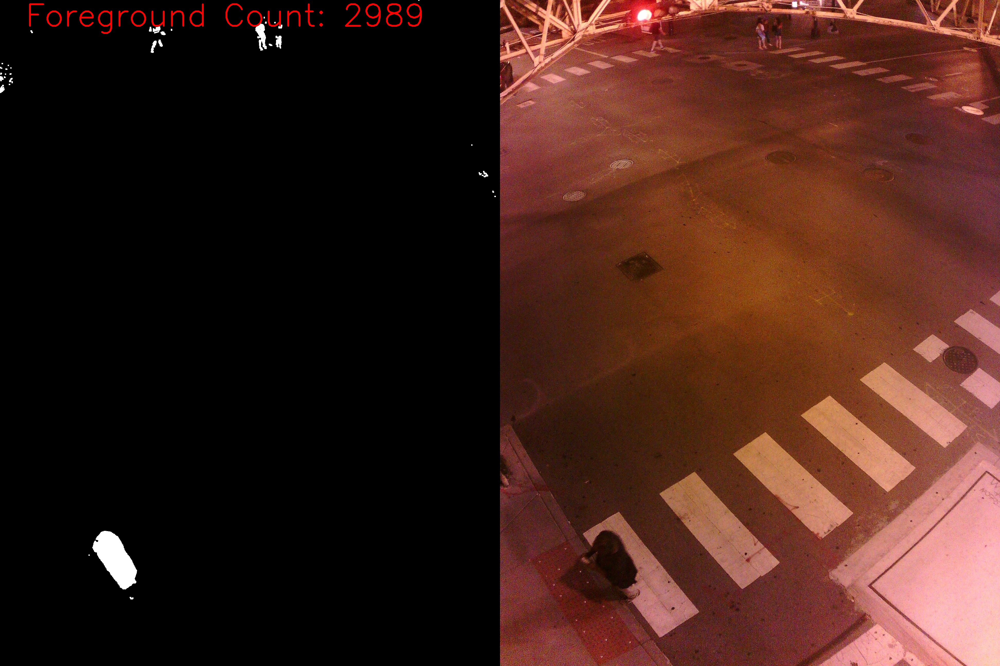
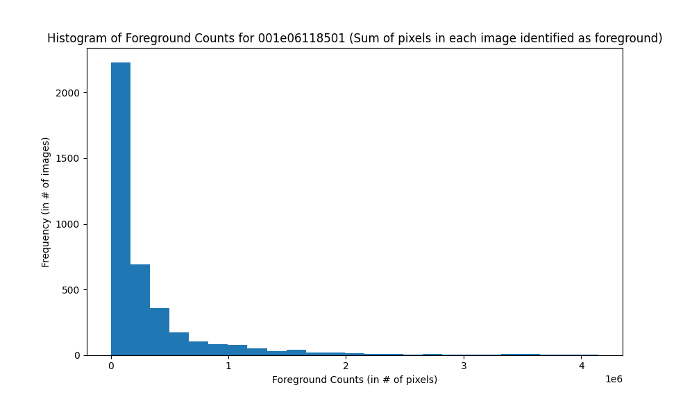
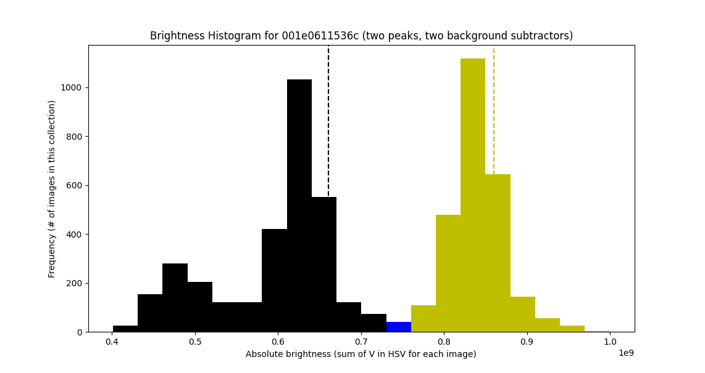
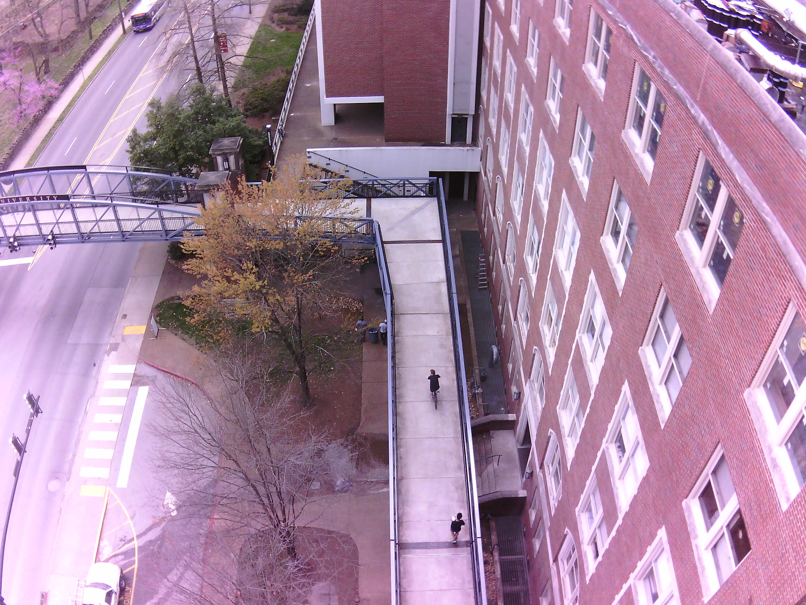

# Sage Image Filtering Pipeline


## How It Works

This pipeline works in three steps:

1. Compute the brightness value of each image in the set, and find the average brightness of day images and night images, respectively. If all the images were taken at one time of day (for example, all in the daytime), the pipeline will detect this and mark the set as having only one average brightness.
2. Train either one or two background subtractors with the given images. (Only one background subtractor is trained if there is only one lighting condition.) The background subtracting model used in the pipeline does not require thousands of images to train on; it can work well even with around 50 training images.
3. Tag each image with a "foreground count" value. This value is useful to assess the likelihood that a given image is a "background image", an image with no interesting foreground features in it. This value is computed by passing an image to the background subtractor, having the subtractor extract the foreground features present in the image (giving us a foreground mask), and counting the number of foreground pixels in the foreground mask. This value by itself means nothing, but it is a adequate metric for judging the "interesting-ness" of an image. A high foreground count suggests a busy image, while a low foreground count suggests an un-interesting background image.
4. Present a few foreground count statistics to the user, prompting them to enter a threshold that will mark the images with the lowest foreground counts as background images. These tags will be written to the root folder of the input image folder in a file named `metadata.json`.


## General Usage

```
usage: feat_detection_pipeline.py [-h] [-P] input_image_folder name

positional arguments:
  input_image_folder  The path to the input image folder / folder hierarchy
  name                A short name for the image collection, ex.
                      "001e061182e8"

optional arguments:
  -h, --help          show this help message and exit
  -P                  Save ProcessedImageCollection objects in state files for
                      easy progress restoration in case something goes wrong
                      (Highly recommended)
```

To process a folder of images:

```
python3 feat_detection_pipeline.py -i [path/to/the/image/folder] -n [a name like 001e0611536c, the name of a node] -P
```

To restore your progress from a `.state` file in case something goes wrong:

```
python3 feat_detection_pipeline.py -i [your state file, like 001e0611536c.state] -n [collection name like 001e0611536c] -P
```


## Choosing a Good Threshold Value

A good threshold value is one that includes images which have the minimum amount of activity that is useful to us and excludes images which have less activity than those images. So for example, this image is a good example of a low-activity image:



We can see mainly only one pedestrian in this picture, since the group of pedestrians in the background are too far away to be included. Note the foreground count at the top left of the image. This would be the lowest acceptable foreground count that we would want to set our threshold to. To set it lower than 2989 would include images with even smaller features, and that does not interest us. On the other hand, to set this value higher than 2989 would exclude images like this which include a single pedestrian. If it is acceptable to cast aside images like this, then set the threshold higher.

The script also provides useful statistics to further narrow down the optimal threshold value to choose. For example these percentiles are output by the script when it comes time to choose a threshold value:

```
----- Bottom Brightnesses -----
10%: 3459
25%: 20793
50%: 121270
```

So if you wish to cut the 25% most un-interesting images, you can select the foreground threshold value of 20793. If you want to cut the image set in half, you can select 121270. You can also select any value you want, which could be between these suggested thresholds.

The script also provides a histogram to visualize the foreground count distribution across the image collection:



This graph shows us a trend that we should expect: most of the images in our set are un-interesting images (images with low foreground counts)


## Day/Night Image Classification

The pipeline is able to use two separate background subtractor models in the case of the day and night image set. This is what a day and night image set looks like:



And a day-only or night-only image set looks like this, having only one peak instead of two:


The internal logic of the script determines how to tag images if there is an obvious day and night split.


## Metadata JSON file format

Example metadata.json file:

```
{
  "background_images": {
    "image/bottom/2020/03/26": [
      "2020-03-26T16:58:24+00:00.jpg",
      "2020-03-26T17:00:09+00:00.jpg",
      "2020-03-26T17:10:27+00:00.jpg",
      "2020-03-26T17:20:14+00:00.jpg"
    ],
    "image/bottom/2020/03/27": [
      "2020-03-27T12:10:10+00:00.jpg",
      "2020-03-27T12:20:07+00:00.jpg",
      "2020-03-27T12:30:28+00:00.jpg",
      "2020-03-27T12:40:16+00:00.jpg",
      "2020-03-27T12:50:04+00:00.jpg",
      "2020-03-27T13:00:19+00:00.jpg",
      "2020-03-27T15:30:21+00:00.jpg",
      "2020-03-27T15:40:12+00:00.jpg",
      "2020-03-27T15:50:10+00:00.jpg",
      "2020-03-27T16:00:10+00:00.jpg",
      "2020-03-27T16:10:24+00:00.jpg"
    ]
  }
}
```

The keys of the `background_images` dictionary are the relative paths to the image folders (relative to the root folder), and the values of the dictionary are lists of images that are tagged as background images.

This format can be easily changed by modifying the `output_metadata_file` method under the `ProcessedImageCollection` class.

## Script Accuracy in Different Environments


## Script Performance

The performance of the script is mainly limited to hard drive speed and the performance of Python OpenCV functions.

The first output given by the script will be a line like this:

```
[LocalImageCollection] Computing brightness values for 1353 images
```

Computing brightness values takes a significant amount of time because for every image in the set, the script has to load it and then compute the sum of all the "V" values for every pixel in that image. (If performance at this stage becomes an issue, it would be wise to change the algorithm that finds this brightness value. There are likely better, less computationally-expensive ways to compare the brightnesses of images than having to sum all their pixel values.)

After this step is complete, the script will output this:

```
[LocalImageCollection] Finished computing brightness values
[LocalImageCollection] Day and night peaks: [887667971.4333334]
[LocalImageCollection] There is only one peak in this brightness data
```

This particular output tells us that we have given it a dataset that is predominantly day-time images, since it found only one peak in the image set.

Next, the script tags images with foreground count values. This operation re-loads every image and gives it to its assigned background subtractor (either day or night if the image set has two defined peaks or just the default one if the image set has only one peak). It then takes the inference of the background subtractor model, which is a foreground mask, applies an OpenCV `MORPH_CLOSE` operation on the mask to reduce noise in the mask, and then computes the sum of the remaining pixels, which represent areas in the image that are foreground blobs.

```
[Tagging] Tagging images with foreground count values
[Tagging] Tagged image 0/1353 with foreground count data
[Tagging] Tagged image 100/1353 with foreground count data
...
```

The script will then prompt the user with the lowest percentiles of foreground counts, the images that are most likely containing just background:

```
----- Bottom Brightnesses -----
10%: 42685
25%: 229626
50%: 610775
```

This information is given to assist the user in selecting a threshold. If the user believes at least half of the images are background images (after looking through a sample of images), he or she should select a threshold at the value `610775` or higher. (In the future it might be useful to completely automate this process by adding a command line option that allows the user to tag the lowest X percent of images in the set.)

After the user provides a threshold value, the script will continue on its merry way, tagging every image with a foreground count value lower than the selected threshold:

```
Select a threshold for filtering background images: 229626
[Tagging] Tagging images under the foreground threshold of: 229626
[Tagging] Processing image 0/1353
[Tagging] Processing image 100/1353
[Tagging] Processing image 200/1353
[Tagging] Processing image 300/1353
[Tagging] Processing image 400/1353
[Tagging] Processing image 500/1353
[Tagging] Processing image 600/1353
[Tagging] Processing image 700/1353
[Tagging] Processing image 800/1353
[Tagging] Processing image 900/1353
[Tagging] Processing image 1000/1353
[Tagging] Processing image 1100/1353
[Tagging] Processing image 1200/1353
[Tagging] Processing image 1300/1353
[LocalImageCollection] Saving collection (../car-data/001e06117b45/)
[JSON Writing] Dumping 337 background image paths into a JSON metadata file (../car-data/001e06117b45/metadata.json)
```

It will then write these tags to a JSON file in the root folder of the images.


## Errors

Sometimes the pipeline flags images with interesting features as background images (false positives) like the one below:



This node view is especially difficult because over the length of the images captured, the trees grow leaves, there are many shadows cast by the bridge and the trees, and the desired features (pedestrians and cars) are very small compared to the size of the noise-causing factors (the trees).