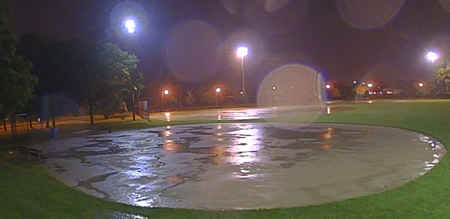
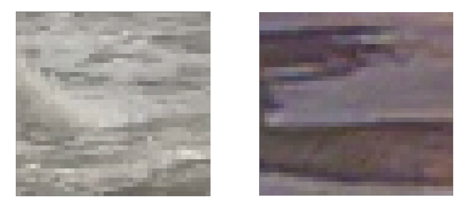
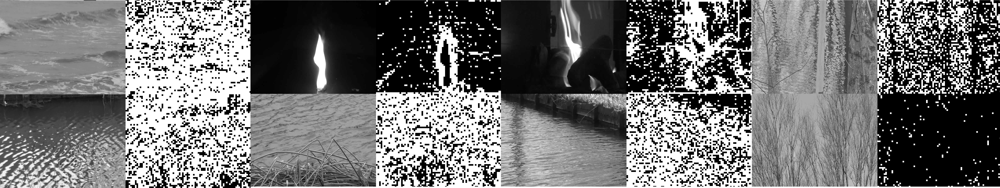
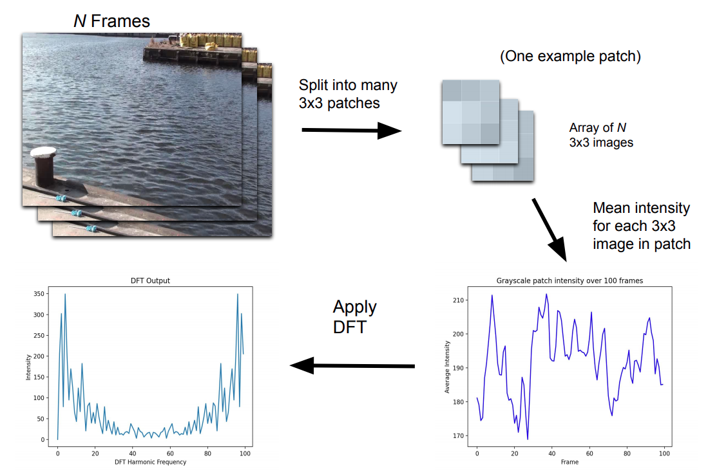

# Computer Vision-based Water Segmentation

### Water and Our Environment

It goes without saying that water is an important part of our environment. Water supports entire ecosystems of animals and is essential to human life. It is one of the most powerful driving forces of nature. But -- as anyone who has fought a losing battling against flooding will tell you -- it can also be a destructive force. Hurricanes and urban flooding can pose serious hazards to the people who live in harm's way. (1) Fortunately, however, we can utilize the power of edge computing to gather insights into the behavior of water to minimize its destruction. The Sage infrastructure will be able to equip hydrologists with the ability to study water in high-risk areas in real time.

My name is Luke Jacobs and I am a rising sophmore at the University of Illinois at Urbana-Champaign. My work within Sage has been researching water segmentation with computer vision and machine learning. The end goal of my work is to develop a general-purpose water segmentation tool that will allow Sage nodes to "see" water in their surroundings. Once this algorithm can be deployed onto Sage nodes, domain scientists like hydrologists will be able to gather hourly data on the level of water present in any environment containing a node. This software will be able to provide them with time-series and location-based data on issues like urban flooding to allow them to better understand how water affects our environment.

### A Visual Model of Water

When you look at the above picture, it takes almost no time at all for you to notice the regions of standing water on this field. That's the way it should be, since "half of the human brain is devoted directly or indirectly to vision", explains Professor Mriganka Sur of MIT's Department of Brain and Cognitive Sciences. (2) A task like identifying water is absolutely trivial to us, but to a computer which has no native understanding of 3-dimensional space, teaching it to "see" is a very challenging task. In fact, the above image is one of the hardest for computers to segment, since it requires an understanding of context, lighting, texture, and color cues all working together.

As humans, we draw on numerous visual cues to identify water. In my research, I programmed classifiers for three cues which, when combined, can help computers distinguish between regions of water and the rest of its environment. These cues are color, texture, and motion. 

### Color

For color identification I researched the use of Gaussian Mixture Models. This classifier was able to, for each pixel in a given image, output a probability value that that pixel was a water pixel. This initial classifier was a naive but efficient method for filtering out areas in an image that the computer was certain could not contain water. Take the following images, for example:

The bottom row are input images to the color classifier. The top row images are the segmentation results of the classifier where yellow pixels correspond to a high probability of water and the dark blue pixels correspond to a low probability of water. As you can see in the first row, the classifier was quite easily able to distinguish the buoy from the ocean. However, example images like these are trivial for classifiers. Segmenting water by color alone would be highly inaccurate, since water can reflect any color. The main role of the color classifier, then, is to flag areas of an image that *cannot possibly be water*, like the red buoy.

### Texture

Because simple color information is not a strong enough cue to classify water spatially, I looked into a texture-based classifier using Local Binary Patterns (LBP's). Local Binary Patterns are a way of representing an image that highlights its low-level grayscale gradients. In the case of water, this is quite helpful, since ripples and waves in water have distinct texture to them.

Intuitively, we can look at these images and say that the one on the left is probably an ocean wave and the one on the right might be a puddle. This is because water lies flat on the ground and exhibits ripples. One of the most helpful questions that I have had to ask myself throughout this research has been: How do *I* know this is water? If I can deduce why my brain thinks what I am looking at is water, then I can program that same line of thinking in a device. 

Each LBP image segmented by the texture classifier was divided into a number of 10 by 10 blocks, which then were separately classified by a Random Forest classifier. This yielded some good results, albeit with some noise:

The black-and-white boxy-looking images represent the predictions of the texture classifier, with the original image to the left. As you can see in the two right-most columns, the classifier can discern a significant difference between a image of a reflection of trees on a pond and an actual image of trees! This is the level of subtly that is important to have in a water segmentation algorithm, since reflections make water difficult to discern.

### Motion

Color and texture are helpful visual cues of water, but what really sets water apart from other scenery is the way it moves. The motion classifier, proposed by the paper "Water detection through spatio-temporal invariant descriptors", is the most sophisticated method for water segmentation that I researched. It involves multiple preprocessing steps, which, although relatively computationally expensive, yield impressive segmentation results:

 

The motion classifier can draw clear divisions between rivers and their boundaries, since it relies on the pixel-level motion of water to make segmentation predictions. This is helpful in supplementing the texture classifier, which struggles with noise, especially around the boundaries of water bodies.

The motion classifier works by first dividing a set of ~60 grayscale frames into many video "patches". Each video patch represents a 3 pixel by 3 pixel space in the video. After the video is broken up into patches, the spatial mean of the grayscale intensity of each patch is computed over the dimension of time. This yields a large number of signals which can then be fed into a discrete fourier transform, the output of which is finally fed into a Random Forest classifier.

The purpose of these preprocessing steps is to allow the Random Forest to perceive the specific motion of small regions of a video. It is able to automatically learn the unique visual frequency bands that characterize the ripples and waves in water, allowing it to identify water with only just a second or two of video footage.

### One Classifier to Rule Them All

The end goal of water segmentation research is to build a general purpose segmentation algorithm. This algorithm should ideally be able to recognize water in any situation from any perspective with just a second or two of input frames. This would enable hydrologists and other scientists to track the behavior of water over time, giving them helpful data to minimize hazards like urban flooding.

Combining the cues of color, texture, and motion enables computers to make predictions about water in their surroundings, but even with three classifiers working together, the algorithm is far from perfect. However, with more research and new approaches, one day Sage will have a unified water algorithm.

### References

1. On average, 1.9 significant flood or torrential rain events occur each year, and $362 million of losses to insured property are incurred each year from such events. (FEMA)
2. http://news.mit.edu/1996/visualprocessing
3. Daytime Water Detection Based on Color Variation
