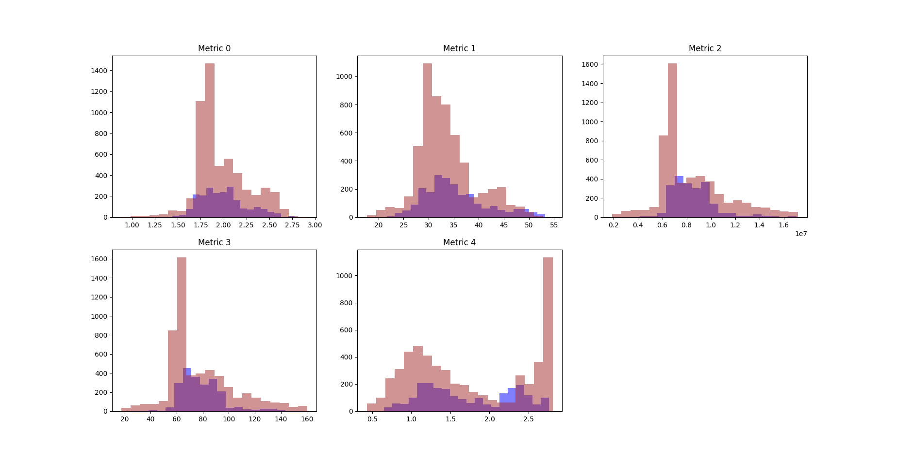

# 6/24

<u>To do</u>

- Find out why the means of a new distribution are so far off from the labeled distribution
- If I can't correct this systematic skew in a natural way, I will have to write a quick transformation function that can force the metrics onto the same space as the metrics from the labeled distribution
- Finish up the water detection algorithm so that I can move on to working with Spencer on our research

<u>Correlations between all my metrics</u>

```
          0         1         2         3         4         5
0  1.000000  
1  0.885815  1.000000  
2  0.822207  0.662209  1.000000  
3  0.814481  0.650568  0.999661  1.000000 
4 -0.444030 -0.165939 -0.626113 -0.629498  1.000000 
5  0.037381  0.142342  0.034190  0.027540 -0.017024  1.000000
```

```
0 - Average value
1 - Sum of variance from average value across image
2 - Per-pixel entropy of grayscale image
3 - Per-pixel entropy of the hue channel of the image (in HSV)
4 - Sum of the Laplacian gradient values per pixel area 
5 - Label (water / no water)
```

This is bad news for the metrics I am using. Looking at the bottom row it appears that there is not much correlation between any metric and the label of the image. It is possible that there is a more complicated relationship, one other than linear, so I do not think I should throw away these results just yet.

One very good thing to take away from this chart is that the two entropy metrics are essentially identical, since they have a correlation value of 0.999. This is good because I can prune away one of the two and retain a similar level of predictive power without one of them. I am going to remove the hue entropy value because if you look at the last row, it appears that grayscale entropy is a better predictor of the image label than the hue entropy, which is interesting (`0.034190 > 0.027540`).

```
          0         1         2         3         4         5         6
0  1.000000  
1  0.947912  1.000000 
2 -0.284559 -0.414842  1.000000 
3  0.320523  0.321655 -0.555878  1.000000  
4  0.315977  0.378620 -0.638884  0.967679  1.000000 
5 -0.266087 -0.369951  0.906902 -0.475239 -0.539158  1.000000 
6 -0.109547  0.027540 -0.057531 -0.040970 -0.005902 -0.028933  1.000000
```

```
0 - Average value
1 - Average value variance
2 - Average hue
3 - Average hue variance
4 - Average saturation
5 - Average saturation variance
6 - Label
```


<u>Metrics</u>

A few histograms to show the overlap between the distributions of water and no water images for various metrics.

