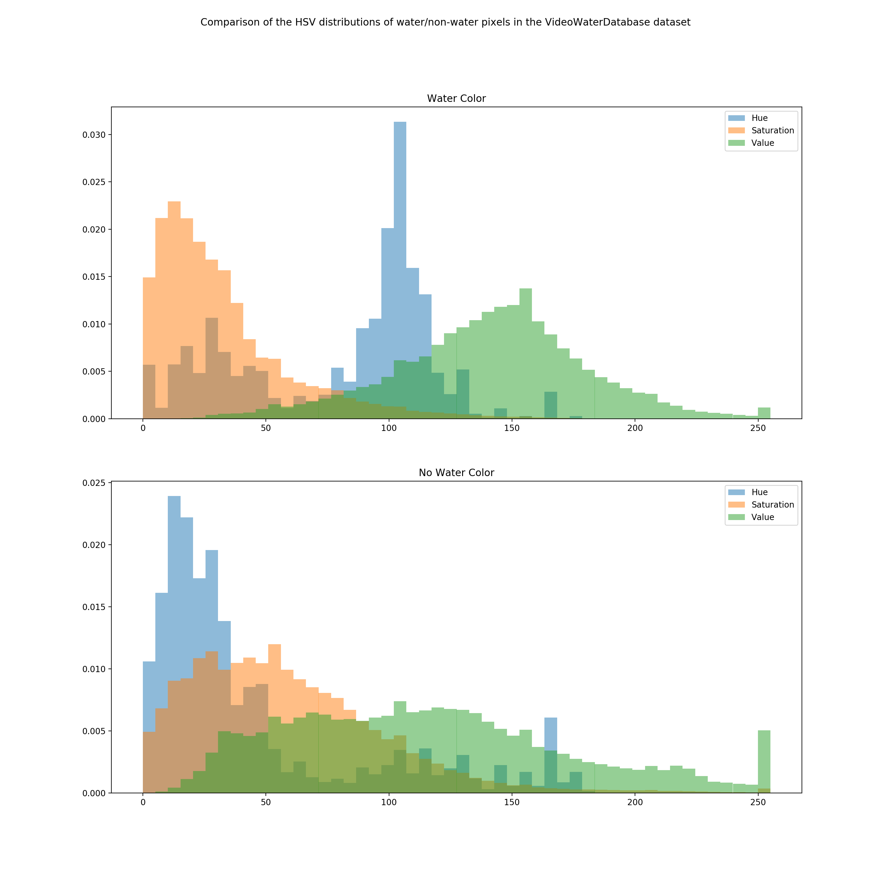
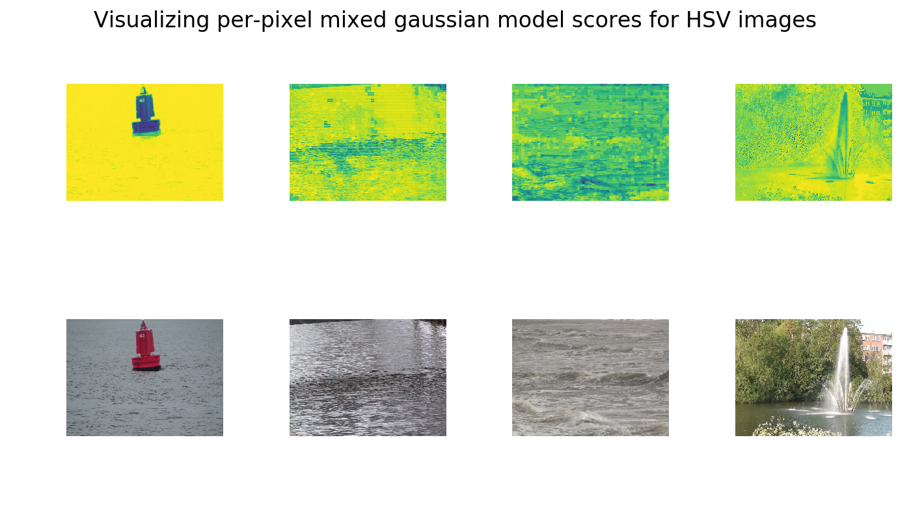

# 7/13

- Worked on completing a Gaussian Mixture Model for the color of water using the data from 155 different scenes

  - Histogram showing the distribution of colors of the water pixels in the VideoWaterDatabase

    

     

  - Examples images that highlight the probability that a given pixel on an image contains water
    

    