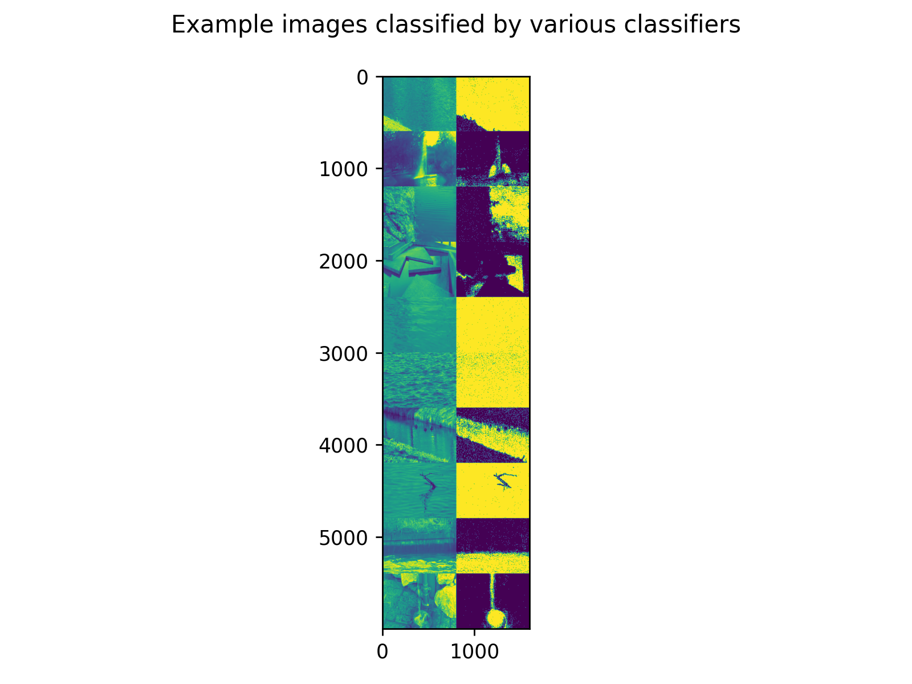

# 7/29

- To Do Today
  - Make an accuracy vs. framerate graph for the texture-temporal classifier
  - Test the TT classifier on new and alternative videos to get a sense of its capabilities
- Texture-temporal classification works very well
  - 
  - It is able to establish clear-cut boundaries especially when water is moving next to a static object or wall
  - One concern I have with it is that is still requires a frame sequence of 60 frames (could be less - need to test its accuracy vs. framerate graph)