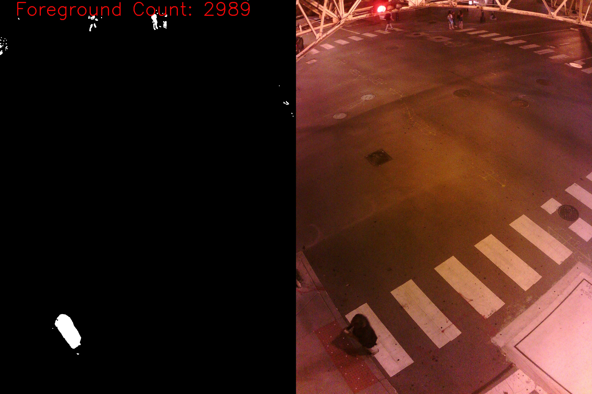
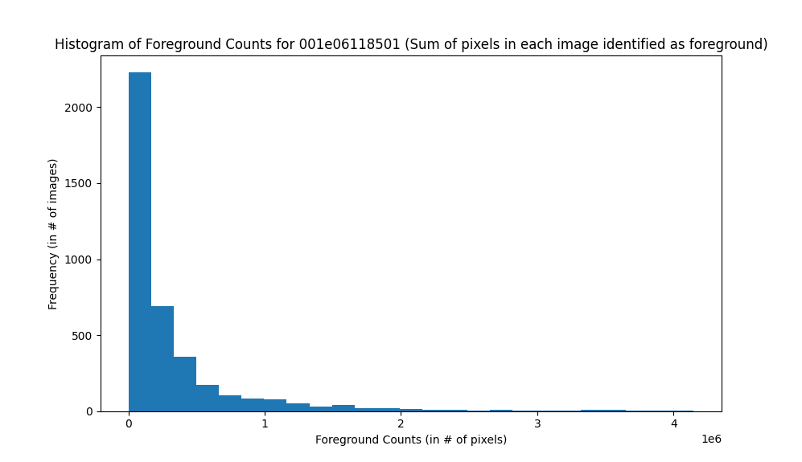
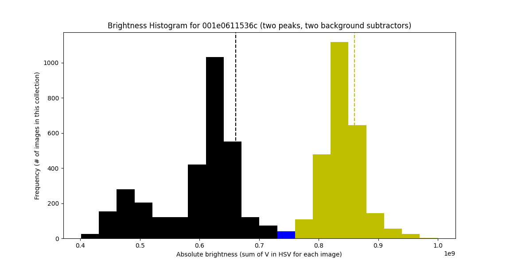
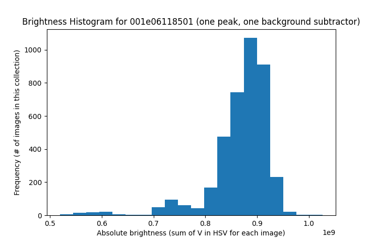

# Sage Image Filtering Pipeline

## How It Works

This pipeline works in three steps:

1. Compute the brightness value of each image in the set, and find the average brightness of day images and night images, respectively. If all the images were taken at one time of day (for example, all in the daytime), the pipeline will detect this and mark the set as having only one average brightness.
2. Train either one or two background subtractors with the given images. (Only one background subtractor is trained if there is only one lighting condition.) The background subtracting model used in the pipeline does not require thousands of images to train on; it can work well even with around 50 training images.
3. Tag each image with a "foreground count" value. This value is useful to assess the likelihood that a given image is a "background image", an image with no interesting foreground features in it. This value is computed by passing an image to the background subtractor, having the subtractor extract the foreground features present in the image (giving us a foreground mask), and counting the number of foreground pixels in the foreground mask. This value by itself means nothing, but it is a adequate metric for judging the "interesting-ness" of an image. A high foreground count suggests a busy image, while a low foreground count suggests an un-interesting background image.
4. Present a few foreground count statistics to the user, prompting them to enter a threshold that will mark the images with the lowest foreground counts as background images. These tags will be written to the root folder of the input image folder in a file named `metadata.json`.

## General Usage

```
usage: feat_detection_pipeline.py [-h] [-P] input_image_folder name

positional arguments:
  input_image_folder  The path to the input image folder / folder hierarchy
  name                A short name for the image collection, ex.
                      "001e061182e8"

optional arguments:
  -h, --help          show this help message and exit
  -P                  Save ProcessedImageCollection objects in state files for
                      easy progress restoration in case something goes wrong
                      (Highly recommended)
```

To process a folder of images:

```
python3 feat_detection_pipeline.py -i [path/to/the/image/folder] -n [a name like 001e0611536c, the name of a node] -P
```

To restore your progress from a `.state` file in case something goes wrong:

```
python3 feat_detection_pipeline.py -i [your state file, like 001e0611536c.state] -n [collection name like 001e0611536c] -P
```


## Choosing a Good Threshold Value

A good threshold value is one that includes images which have the minimum amount of activity that is useful to us and excludes images which have less activity than those images. So for example, this image is a good example of a low-activity image:



We can see mainly only one pedestrian in this picture, since the group of pedestrians in the background are too far away to be included. Note the foreground count at the top left of the image. This would be the lowest acceptable foreground count that we would want to set our threshold to. To set it lower than 2989 would include images with even smaller features, and that does not interest us. On the other hand, to set this value higher than 2989 would exclude images like this which include a single pedestrian. If it is acceptable to cast aside images like this, then set the threshold higher.

The script also provides useful statistics to further narrow down the optimal threshold value to choose. For example these percentiles are output by the script when it comes time to choose a threshold value:

```
----- Bottom Brightnesses -----
10%: 3459
25%: 20793
50%: 121270
```

So if you wish to cut the 25% most un-interesting images, you can select the foreground threshold value of 20793. If you want to cut the image set in half, you can select 121270. You can also select any value you want, which could be between these suggested thresholds.

The script also provides a histogram to visualize the foreground count distribution across the image collection:



This graph shows us a trend that we should expect: most of the images in our set are un-interesting images (images with low foreground counts)

## Day/Night Image Classification

The pipeline is able to use two separate background subtractor models in the case of the day and night image set. This is what a day and night image set looks like:



And a day-only or night-only image set looks like this, having only one peak instead of two:



The internal logic of the script determines how to tag images if there is an obvious day and night split.