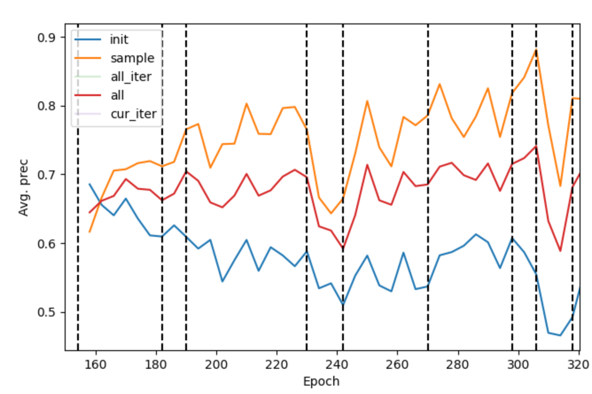
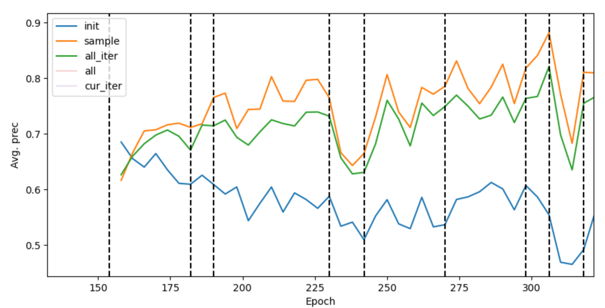
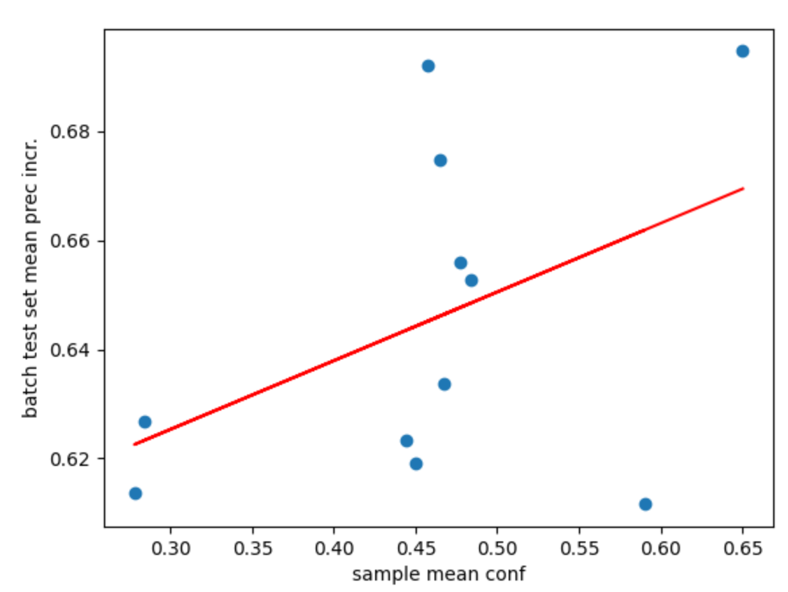
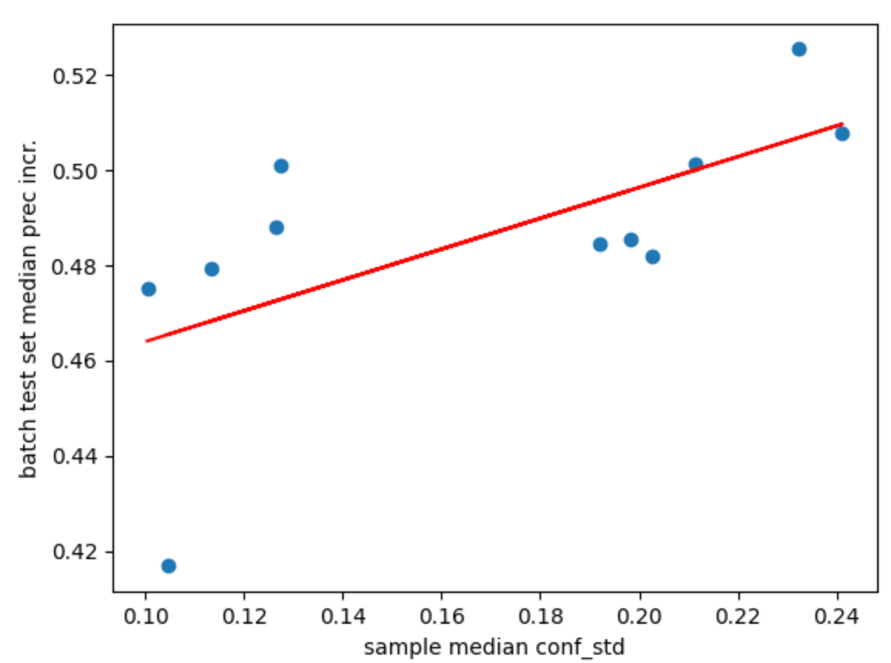
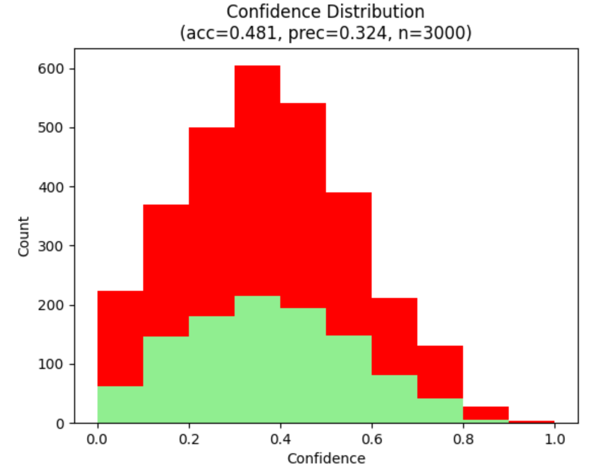
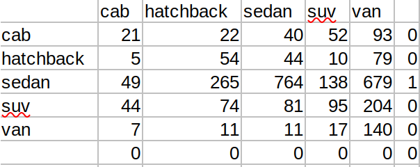
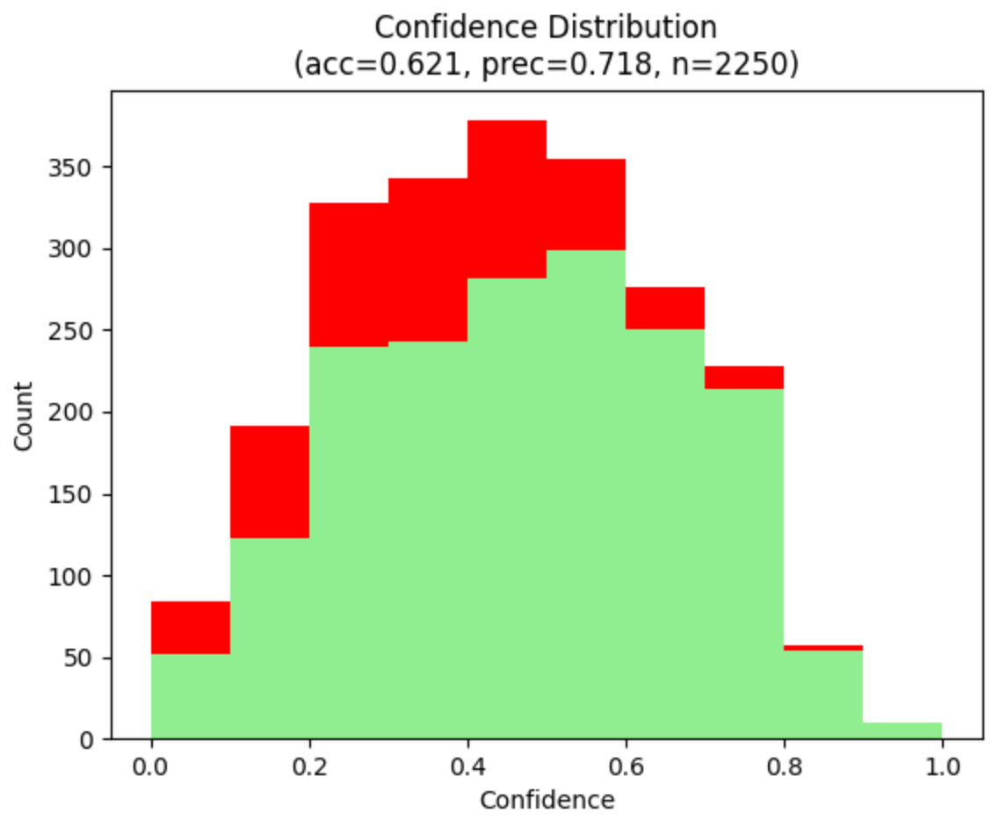
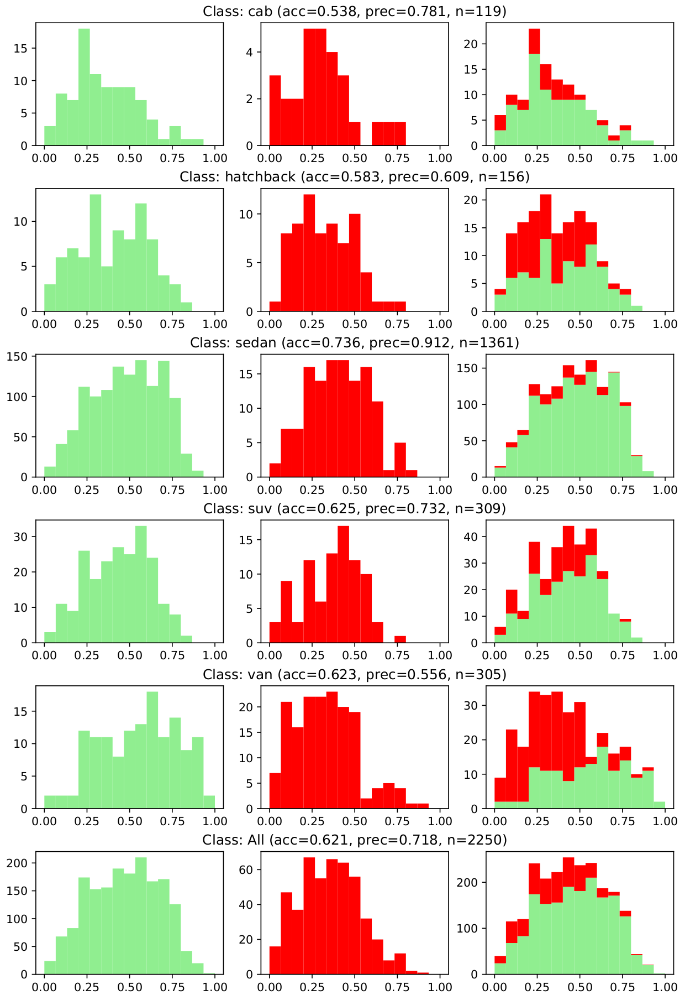

# Analysis Tool Usage

Aside from the [main module](./__main__.py) for starting the sampling and retraining pipeline, a [script for analyzing training results](./analyze.py) is included in this folder. The program supports the following features:

* Benchmarking against various test sets as a function of one or multiple averaged models and plotting the resultant training curves
* Tabulating performance metrics (precision, accuracy, recall, avg. confidence) for a particular benchmark
* Comparing metrics across various sampling methods using next-batch test methods
* Linear regression between two metrics to analyze correlation between sample features and performance improvements
* Generating confidence distributions of inference results for each sample batch
* Filtering sample batches for the specific images collected in that sample

To use the script, execute the following:

```
python3 analyze.py --config <retrain config file> \
        [--benchmark [--delta <epoch span>] [--avg [<epoch span>] | --roll <epoch span>]] \
	(--prefix <sampling method> | --tabulate | --visualize <benchmark> | --view_benchmark <benchmark>) \
	[--filter_sample --compare_init --batch_test <test set size> --aggr_median] \
	[--metric <metric name> --metric2 <metric name>]
```

The only required argument is `--config` along with the path to the pipeline configuration file. However, for the script to produce a visual output, one of the additional flags in parentheses must be specified. The `--benchmark` flag may also be set to generate benchmark files if they have not yet been generated.

Many flags also have additional optional parameters for filtering out data. See below for a description of each flag and how flags may be used in conjunction.

## Benchmarking

There are two main types of benchmarking for accuracy, precision, and confidence, both of which can be conducted when the `--benchmark` flag is specified:

* **Series benchmarking** continuously benchmarks checkpoint models at an interval specified by `--delta` (default of 4 epochs), for all models generated in the initial training or retraining process. This is done instantaneously for a single model by default. If `--avg` or `--roll_avg` are specified with an integer epoch span, a linearly-spaced or rolling average of checkpoint models will be taken instead. Files will be saved at the path `<output>/<prefix>-series[[-roll]-avg]/<test set>_<epoch>.csv`, where the test set name is one of the following:
  * `init`: test set generated from initial training
  * `sample`: all test sets generated from the sample images
  * `cur_iter`: test set of the current iteration when retraining, where this is a mix of 75% samples from the current iteration and 25% seen test set images
  * `all_iter`: a union of all images in iteration test sets
  * `all`: a union of all of the above images
* **Batch split benchmarking** finds the epochs at which training for a particular batch of images (either samples or the initial training set) ends and benchmarks the performance of the models thus far against a test set that the model has not yet seen. By default, this uses all images in the next batch of images and benchmarks using a linearly-sapced model average. The `--roll_avg` flag may be set to use a rolling average instead. Note that these benchmarks are generated as a byproduct of the sampling pipeline. Output files have the format `<output>/<prefix><next batch number>_benchmark[_roll]_avg[_test]_1_<last epoch>.csv` (i.e. `sampling0_benchmark_avg_1_50.csv` will  benchmark the initial training models, and `sampling1_benchmark_avg_1_75.csv` will benchmark the models after the first retraining iteration).

**Additional Notes**

* If the `--batch_test <N>` flag is specified with a certain number of image batches, the last `N` batches sampled upon for iterative retraining will be set aside and used as a consistent test set across all epoch models. This will replace next-batch testing when benchmarking at batch splits (appending `_test` to the output file), and an additional test set will be added (as `batch_test`) in series benchmarking. The models generated during the last `N` iterations of training (where training is done with images in this test set) will also not be benchmarked. 
* By default, if the `--prefix <sampling method>` flag is not specified, only batch split benchmarking will be performed on all sampling methods. This is parallelized across GPUs if `parallel` is true in the configuration file. 
* If the `--prefix` flag is set, only the specified sampling method will be benchmarked, and series benchmarking will be conducted.
* Aside from filename differences, all benchmark files have contents that follow the [benchmarks generated from the sampling pipeline](./README.md#training-output).
* Benchmarking is the first step done in the script, so `--benchmark` may be used alongside one of the visualization options to ensure benchmarks are generated.

**Example Usage**

Benchmark series and next batch testing on a sampling method:

```
python3 analyze.py --config config/car-retrain-60.cfg --benchmark --prefix random --avg 8
```

Benchmark batch testing on all sampling methods:

```
python3 analyze.py --config config/car-retrain-60.cfg --benchmark --batch_test 2 --roll 10
```

## Training Curves

Plots of a sampling method's performance over time can be viewed by specifying its name with `--prefix <name>`. A precision-epoch curve will be generated by default, with lines representing each of the test sets created via series benchmarking. Click on the lines in the legend to enable/disable them.

Other metrics besides precision can be viewed by specifying one of the following metric names with the `--metric` flag: 
* `acc`
* `recall`
* `conf` (for mean average confidence, aggregated across class)
* `conf_std` (for average standard deviation in confidence values, aggregated across class)
* `detect_conf_std` (for the average standard deviation across each detection when averaging them together)

A line for the batch test set can be added by specifying the `--batch_test <N>` flag.

**Sample Usage**

```
python3 analyze.py --config config/cars-retrain-60.cfg --prefix random --avg
```

Output:




```
python3 analyze.py --config config/cars-retrain-60.cfg --prefix random 
```

Output:




## Sampling Method Metric Tables

Tables of the available metrics (`prec`, `acc`, `recall`, `conf`, `conf_std`, `detect_conf_std`, and `epochs_trained`) can be generated for a particular sampling method (with various metrics shown) or for a particular metric (with various sampling methods shown) with the `--tabulate` flag. To see the former, specify the sampling method with `--prefix`, or see the latter with the `--metric` flag. If neither is specified, `--tabulate` will generate a table of average precisions across all sampling methods.

In either case, metrics or sampling methods are displayed as rows, with the batch split benchmaarks as columns, indexed by iteration number. The default option is to view next-batch benchmarking results, though you can view batch test set benchmarking results with the `--batch_test <N>` flag.

**Additional Options**

* Add the `--compare` flag to show increases/decreases in a metric (precision, accuracy, etc.) against the initial baseline (as shown by the `init` prefix)
* Add the `--filter_sample` flag to filter results to account only for images that are later used for that iteration's sample set

**Sample Usage**

For one sampling method:

```
python3 analyze.py --config config/cars-retrain-60.cfg --prefix random  --tabulate
```

```
 batch      prec       acc      conf  conf_std  detect_conf_std    recall  epochs_trained
     0  0.311164  0.491860  0.338325  0.173268         0.403783  0.583568              28
     1  0.406101  0.509591  0.334535  0.176635         0.439110  0.580996               8
     2  0.421932  0.516707  0.316528  0.174037         0.442507  0.551614              40
     3  0.515876  0.531565  0.337421  0.186563         0.477885  0.569941              12
     4  0.591425  0.572488  0.324583  0.188321         0.484251  0.582745              28
     5  0.616561  0.571106  0.366749  0.195864         0.488073  0.649979              28
     6  0.680778  0.604911  0.361908  0.204501         0.513904  0.638999               8
     7  0.673259  0.604047  0.348814  0.198615         0.492656  0.625689              12
```

For all sampling methods (with comparison to `init`)

```
python3 analyze.py --config config/cars-retrain-60.cfg --tabulate --compare
```

```
                           0         1         2         3   ...        9         10        11        12
init                 0.328333  0.344961  0.357781  0.312838  ...  0.318059  0.310797  0.347531  0.339711
median-below-thresh -0.010333 -0.001780  0.293421  0.393084  ...  0.499396  0.484044  0.482102  0.473319
median-thresh        0.003813 -0.007295  0.032637  0.119702  ...  0.475165  0.429007  0.450010  0.468543
bin-quintile         0.003927 -0.018624  0.029780  0.292179  ...  0.417049  0.432177  0.438569  0.487629
random              -0.017169  0.061140  0.064151  0.203038  ...  0.369299  0.399612  0.414299  0.480873
true-random         -0.005519  0.240768  0.348203  0.450966  ...  0.506345  0.533644  0.498143  0.509471
bin-normal          -0.001293  0.176839  0.243997  0.349843  ...  0.501222  0.495279  0.526686  0.485863
mid-below-thresh     0.014965 -0.014123  0.001097  0.092967  ...  0.423530  0.431126  0.412229  0.450042
iqr                 -0.010156  0.089740  0.312512  0.464376  ...  0.530171  0.520778  0.502352  0.507779
normal              -0.016627  0.003678  0.029324  0.134277  ...  0.495587  0.510103  0.461814  0.472574
mid-normal           0.002906  0.008725  0.336031  0.375557  ...  0.460545  0.473601  0.479242  0.511433
mid-thresh          -0.011674 -0.002626  0.195865  0.304967  ...  0.468166  0.486707  0.461788  0.501533
```

No comparison, viewing accuracy of samples:

```
python3 analyze.py --config config/cars-retrain-60.cfg --tabulate --metric acc --filter_sample
```

```
                           0         1         2         3   ...        9         10        11        12
init                 0.459451  0.469484  0.470021  0.449144  ...  0.446016  0.455094  0.475969  0.455449
median-below-thresh  0.318508  0.373596  0.469513  0.441280  ...  0.490285  0.507103  0.562396  0.565060
median-thresh        0.495944  0.522196  0.549997  0.611505  ...  0.857690  0.835316  0.857827  0.871847
bin-quintile         0.372710  0.351555  0.392423  0.482094  ...  0.588626  0.596437  0.634470  0.670795
random               0.366899  0.423152  0.408761  0.446159  ...  0.560642  0.620770  0.595009  0.682268
true-random          0.401916  0.527465  0.637765  0.659676  ...  0.721015  0.747749  0.720669  0.743951
bin-normal           0.420866  0.533274  0.568566  0.608789  ...  0.677813  0.667618  0.716641  0.677905
mid-below-thresh     0.565270  0.483441  0.473931  0.540685  ...  0.502370  0.486606  0.525246  0.517606
iqr                  0.546515  0.632693  0.772187  0.797134  ...  0.884629  0.891250  0.873309  0.888314
normal               0.401701  0.384894  0.461695  0.459068  ...  0.692469  0.715602  0.712322  0.742966
mid-normal           0.462098  0.426187  0.659218  0.629840  ...  0.674171  0.702299  0.702093  0.783372
mid-thresh           0.346365  0.393452  0.655785  0.714659  ...  0.839187  0.836832  0.854227  0.866529
```

## Comparing Metrics

Using batch split benchmarks, metrics of the samples in each sampling method can be correlated against the performance of the resultant models after retraining at each batch. By specifying metric names with `--metric` and `--metric2` when using `--tabulate`, a linear regression will be run by averaging `--metric` of the samples for a particular sampling method and `--metric2` of the resultant models. That is, a point will be generated for each sampling method that is present, with average `metric` (across the batches of that method) on the x-axis and average `metric2` on the y-axis. Statistics of that regression and the points used to generate it will also be printed.

**Additional Options**
* Add the `--aggr_median` flag to aggregate using a median instead an average. This is useful when there may be confounding factors skewing the batch splits, such as the number of epochs trained
* The `--compare` flag may be used to show increases/decreases against the `init` baseline
* Specify the `--batch_test <N>` flag to run a regression using the batch test benchmarks instead of the next-batch benchmarks. In this case, the `--compare` flag will only shift the results by a constant amount, as the test set is constant across batch splits. The last `N` batch splits will also not be used in the regression.

**Sample Usage**

Regression with average aggregate:

```
python3 analyze.py --config config/cars-retrain-15.cfg --tabulate --metric conf --metric2 prec
```

```
Baseline avg prec:  0.3294131816688472
                     mean conf  mean prec
Method                                   
mid-below-thresh      0.277751   0.613627
median-below-thresh   0.283745   0.626900
normal                0.443958   0.623414
bin-normal            0.449909   0.619128
bin-quintile          0.457157   0.692167
mid-normal            0.465288   0.674860
random                0.467273   0.633728
true-random           0.477376   0.656000
iqr                   0.484178   0.652709
median-thresh         0.590214   0.611613
mid-thresh            0.650371   0.694701
R^2: 0.1990793189260579
```



Regression with median aggregate and comparison to baseline, using batch test set benchmarks:

```
python3 analyze.py --config config/cars-retrain-75.cfg --tabulate --metric conf_std --metric2 prec --batch_test 2 --compare --aggr_median
```

```
Baseline avg prec:  0.3215912810238094
                     median conf_std  median prec
Method                                           
median-below-thresh         0.100441     0.475043
mid-thresh                  0.104536     0.416886
iqr                         0.113265     0.479326
median-thresh               0.126512     0.487936
mid-below-thresh            0.127420     0.501075
mid-normal                  0.192013     0.484656
normal                      0.198154     0.485409
true-random                 0.202744     0.481939
bin-normal                  0.211258     0.501331
random                      0.232361     0.525439
bin-quintile                0.241153     0.507647
R^2: 0.40822675442337875
```




## Benchmark Metric Table

View the individual and averaged metrics on a per-class basis on a benchmark with the `--view_benchmark <benchmark file>` option. A table of results will also be generated `<benchmark filename>_stats.csv`. All other flags are ignored.

**Sample Usage**

```
python3 analyze.py --config config/cars-retrain-75.cfg --view_benchmark output/bw-75/init0_benchmark_test_154.csv
```

```
                N      Prec       Acc    Recall  Avg. Conf  Conf Std
Class                                                               
cab         235.0  0.218310  0.472340  0.704545   0.381165  0.214382
hatchback  1371.0  0.150963  0.359592  0.788360   0.392307  0.165237
sedan      2375.0  0.796639  0.656421  0.758400   0.432117  0.185662
suv         582.0  0.326146  0.467354  0.668508   0.354609  0.157175
van        2251.0  0.115900  0.303421  0.799197   0.500592  0.231009
Overall    6814.0  0.321591  0.451826  0.743802   0.412158  0.190693
```

## Benchmark Confidence Histogram

Use `--visualize_conf <benchmark file>` to view confidence histogram distributions of hits (accurate label predictions) and misses (inaccurate predictions) for a particular benchmark. Three histograms (hits, misses, and combined) will be shown, and a PDF of the confidence distribution per class will be generated at `<benchmark filename>_viz.pdf`. A confusion matrix will also be generated at `<benchmark filename>_conf.csv` along with a CSV file containing the rolling precision of the distribution (at 0.05 confidence intervals) at `<benchmark filename>_prec.csv`.

Use the `--filter_sample` flag to filter by the images in the sample if (and only if) viewing a benchmark file at a batch split epoch. When using this option, `--prefix` must be specified to fetch the correct sample files.

**Sample Usage**

```
python3 analyze.py --config config/cars-retrain-75.cfg \
    --visualize_conf output/bw-75/true-random0_benchmark_avg_1_154.csv
```



Contents of `output/bw-75/true-random0_benchmark_avg_1_154_conf.csv`:



Usage where samples are filtered:

```
python3 analyze.py --config config/cars-retrain-75.cfg \ 
    --visualize_conf output/bw-75/bin-normal5_benchmark_avg_1_330.csv \
    --filter_sample --prefix bin-normal
```



Contents of `output/bw-75/bin-normal5_benchmark_avg_1_330_prec.csv`

```
conf	rolling precision	N
0.325	0.681318681318681	182
0.375	0.739130434782609	161
0.425	0.734042553191489	188
0.475	0.757894736842105	190
0.525	0.819672131147541	183
0.575	0.866279069767442	172
0.625	0.892857142857143	140
0.675	0.919117647058823	136
0.725	0.955555555555556	135
0.775	0.913978494623656	93
0.825	0.974358974358974	39
0.875	0.888888888888889	18
0.925	1			9
0.975	1			1
```

Contents of `output/bw-75/bin-normal5_benchmark_avg_1_330_viz.csv`


